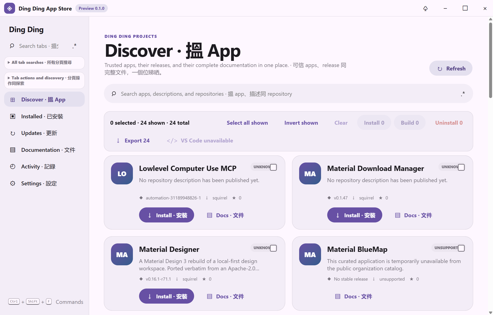
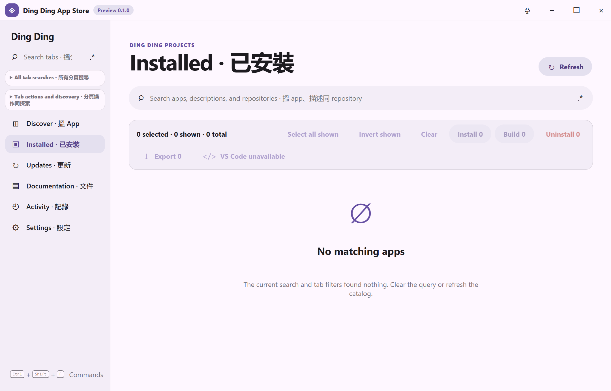
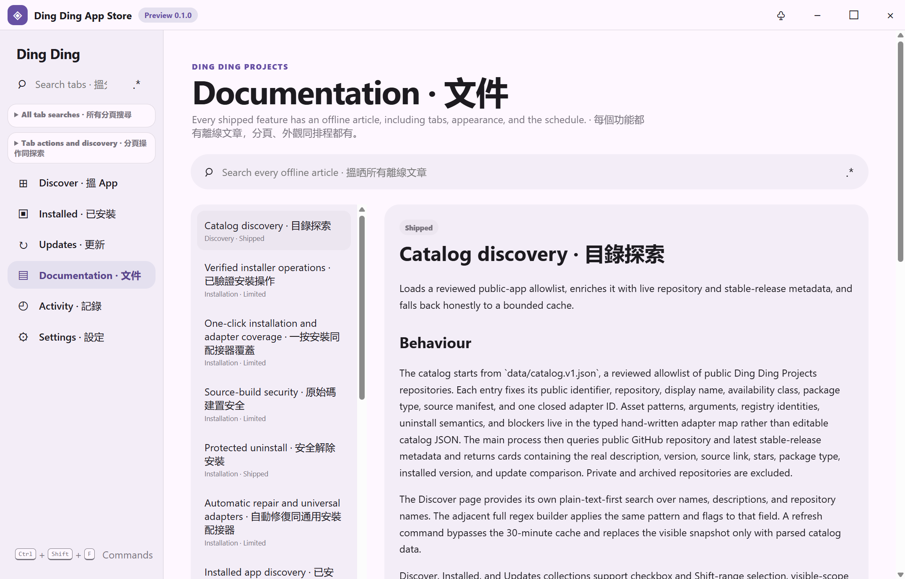
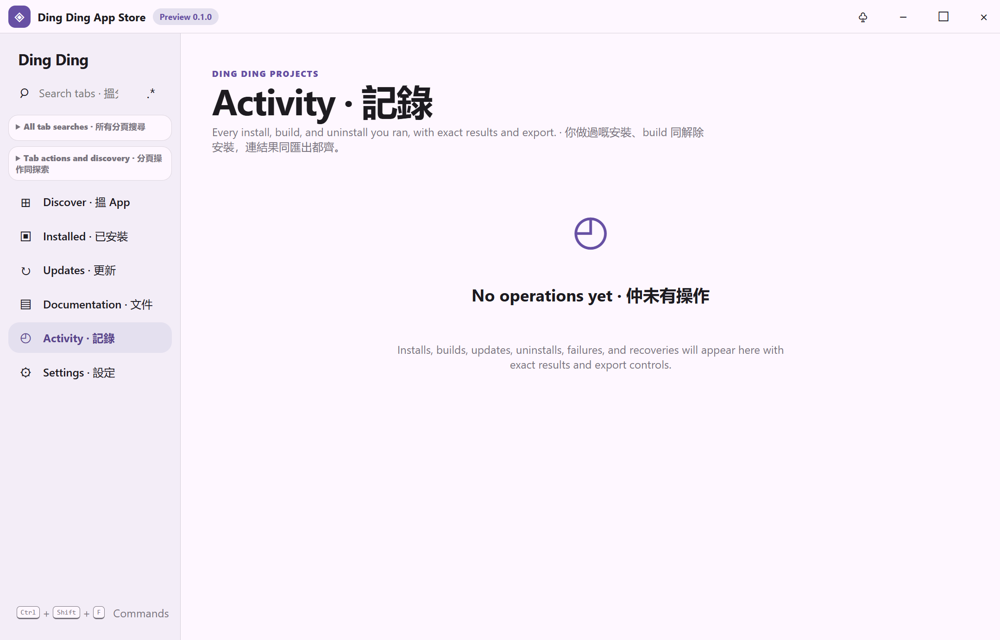
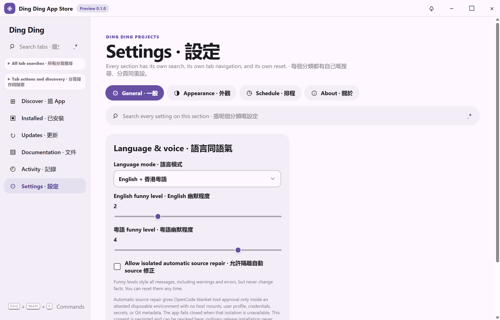
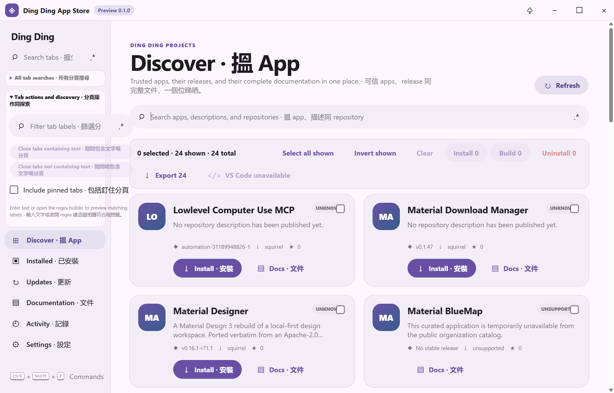
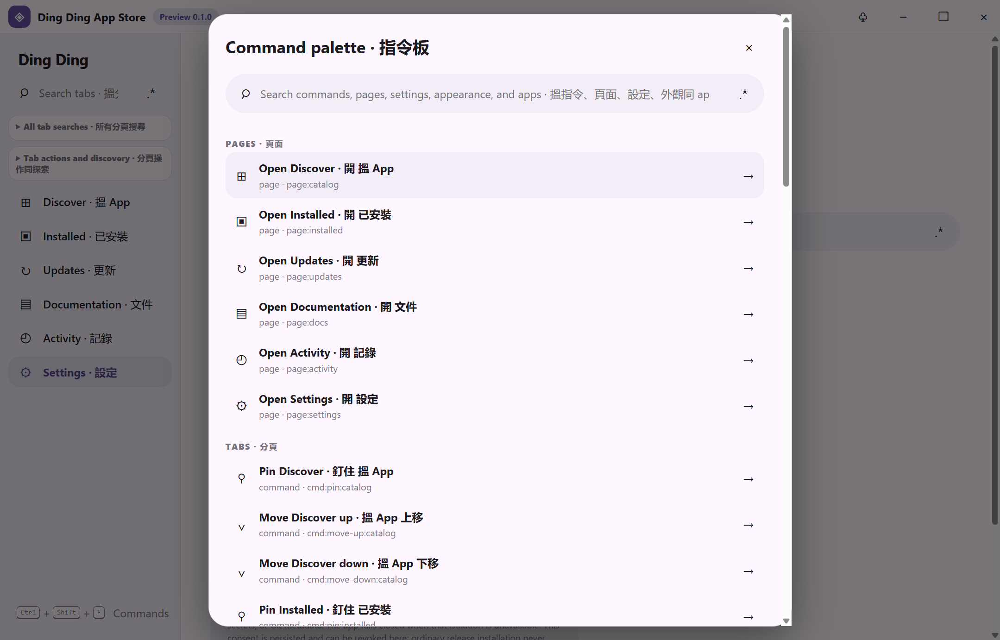
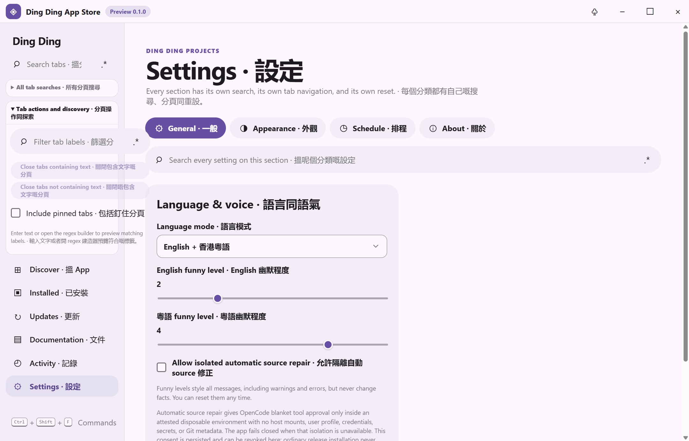

# Ding Ding App Store

Material Design 3 desktop software center for discovering, documenting, installing, updating, building, and uninstalling supported public applications from [Ding Ding Projects](https://github.com/Ding-Ding-Projects).

`npm install && npm start`

**Documentation site:** <https://ding-ding-projects.github.io/ding-ding-app-store/><br>
**Current state:** active development; a verified unsigned Windows release is [`v0.1.0-284-1`](https://github.com/Ding-Ding-Projects/ding-ding-app-store/releases/tag/v0.1.0-284-1), code-named **Steamed Bean Curd Skin Roll · 鮮竹卷**. Newer verified builds are listed on the [releases page](https://github.com/Ding-Ding-Projects/ding-ding-app-store/releases).

## Contents

- [Application architecture](#application-architecture)
- [Screenshot gallery](#screenshot-gallery)
- [Security and trust](#security-and-trust)
- [Development](#development)
- [Project guidance](#project-guidance)

<details id="application-architecture">
<summary><strong>Application architecture</strong></summary>

- Frameless Electron window with a React/TypeScript Material Design 3 renderer.
- Sandboxed renderer (`contextIsolation`, no Node integration) and a narrow typed preload bridge.
- Reviewed, versioned public catalog; private repositories and infrastructure never enter the product catalog.
- Stable-release comparison for every catalog entry and a separate unsigned Squirrel self-updater with bounded RELEASES/package-hash validation, cancellable discovery/download states, immutable release-note links, rollback warning, and explicit restart-only installation.
- A closed 24-ID install-adapter map: 21 reviewed Squirrel/MSI/NSIS/Mozilla-NSIS/jpackage/portable routes and three explicit public-state blockers.
- Exact registry/managed-portable discovery, freshly derived protected removal descriptors, append-only operation history, local Git snapshots, and filtered multi-format export.
- Installer execution owned by the main process; the renderer cannot provide commands, paths, URLs, or arguments.
- Offline documentation articles with an in-app browser and full local search/regex builder.
- Persistent browser-style tab rail with left/right/top/bottom docking, pinning, grouping, overflow, four independent regex-backed tab searches, reversible bulk close/reopen, and complete keyboard control.
- Per-surface search state, a full regex builder everywhere, and a command palette that reaches every page, command, setting, and appearance control.
- Per-element appearance editor with live preview, reset, and export/import, applied through CSS custom properties only.
- Every exposed export surface also offers a truthful Open in VS Code action: the main process validates PATH/install locations or a native portable selection, writes an app-owned workspace, and launches with shell-free arguments; ordinary downloads remain available when VS Code is absent.
- Main-process update schedule with a launch check that cannot be disabled, bounded repeat intervals, and quiet hours that hold notifications without delaying checks.

</details>

<details>
<summary><strong>Packaged runtime evidence</strong></summary>

The unsigned packaged application was driven on the sanctioned hidden Windows desktop. Fresh captures from the current production build cover the catalog, install status, updates, documentation browser, activity/export history, settings, appearance controls, command palette, and tab action/search controls.

</details>

<details id="screenshot-gallery">
<summary><strong>Screenshot gallery — real packaged surfaces</strong></summary>

These captures are from the built application on the hidden Windows desktop; they are evidence of the rendered surfaces, not mockups. The gallery covers the main workspace, tab controls, command discovery, settings, appearance, and export surfaces. Install is one click; only uninstall keeps the native destructive gate.

| Surface | Runtime capture |
| --- | --- |
| Catalog discovery, bilingual navigation, search, one-click install cards, and command-palette hint |  |
| Installed tab and empty-state detection when no App Store-managed apps are present |  |
| Updates tab with the same per-surface search and bulk controls |  |
| Offline documentation browser rendered inside the app |  |
| Append-only activity history and export surface |  |
| Settings surface with section tabs, search, language, funny-level, and source-repair consent controls |  |
| Appearance settings with rail layout preview and customization controls |  |
| Command palette listing pages and tab commands |  |
| Tab action panel with local filter, regex builder affordance, pinned-tab protection, and bulk-close previews |  |

</details>

<details id="security-and-trust">
<summary><strong>Security and trust</strong></summary>

Install and Reinstall are genuine one-click actions: the catalog button immediately submits only the application ID and a closed install decision, with no phrase-entry dialog. Installable assets still require an allowlisted application, one app-specific adapter, an HTTPS GitHub release origin, bounded declared/received size, and either GitHub SHA-256 metadata or a GitHub-digested companion checksum. Install results are recorded only after hidden shell-free execution and exact installed-app rediscovery. Uninstall re-derives its authority from the current reviewed registry/portable identity and still requires the two-key plus full-slider destructive confirmation.

The common dispatch is implemented, but fully automatic fresh-Windows coverage is not: the current [24-app adapter matrix](docs/features/installation/one-click-installation.md) records every missing release, archive, source-toolchain, dependency-bootstrap, disposable-runner, bounded OpenCode-repair, cancellation, and runtime-proof requirement without treating a guessed command as an adapter.

Source recipes are catalogued but are never executed directly on the host. The app reports Windows Sandbox binary presence separately from feature-state and guest-transport evidence, and enables that path only through a disposable, resource-bounded Windows build runner with a reviewed transport.

Code signing is intentionally prohibited. Published Windows packages are unsigned and may trigger Windows SmartScreen or an unknown-publisher warning.

</details>

<details id="development">
<summary><strong>Development and verification</strong></summary>

```powershell
npm install
npm run check
npm run build
npm run dist
```

The application uses Squirrel.Windows. A successful package must contain `Setup.exe`, `RELEASES`, and a full `.nupkg`, and the executable must be verified as unsigned.

The tab rail is a real persisted workspace: it defaults to the left edge but can dock to any edge, keeps pinned tabs protected, gives every strip/group/group-name/master search its own regex builder state, and previews **Close tabs containing text** / **Close tabs not containing text** before a second confirmation click. Closed tabs remain recoverable from the tab-actions panel; the final open tab cannot be closed.

</details>

<details id="project-guidance">
<summary><strong>Project guidance</strong></summary>

Repository-specific agent rules are in [`AGENTS.md`](AGENTS.md). The feature documentation under [`docs/features/`](docs/features/) and the in-app documentation bundle are the behavior record; update both whenever behavior changes.

</details>

## License

Apache-2.0. See [`LICENSE`](LICENSE).
