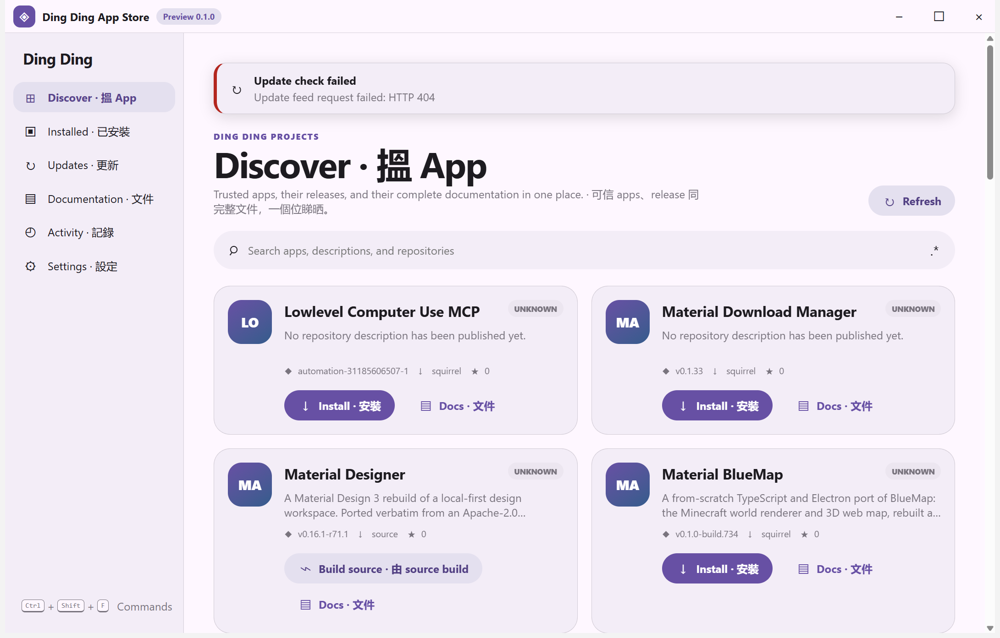
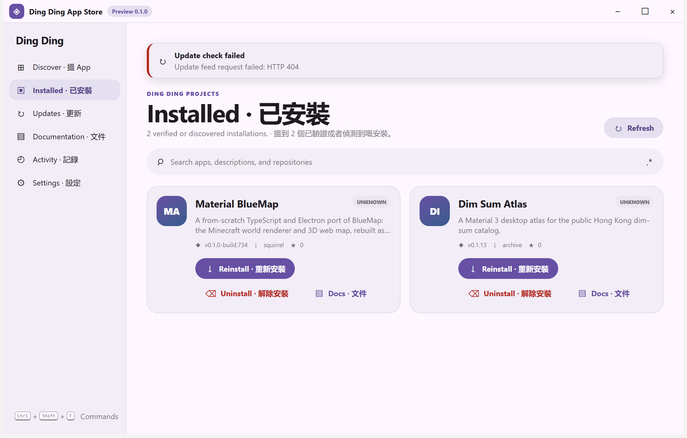
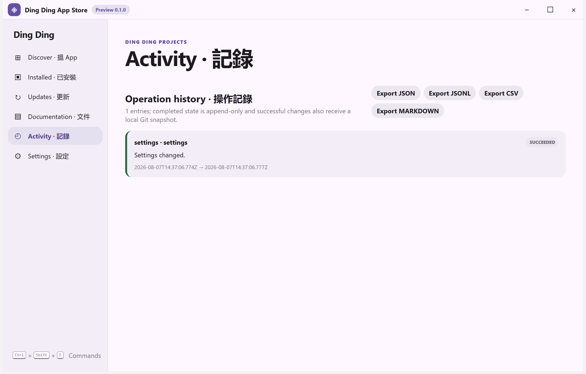

# Ding Ding App Store

Material Design 3 desktop software center for discovering, documenting, installing, updating, building, and uninstalling supported public applications from [Ding Ding Projects](https://github.com/Ding-Ding-Projects).

`npm install && npm start`

**Documentation site:** <https://ding-ding-projects.github.io/ding-ding-app-store/><br>
**Current state:** active development; every successful cloud workflow publishes a verified unsigned Windows release with immutable Squirrel assets. See the [releases page](https://github.com/Ding-Ding-Projects/ding-ding-app-store/releases) for the current version, code name, timing, line-count table, and download files.

## Contents

- [Application architecture](#application-architecture)
- [Screenshot gallery](#screenshot-gallery)
- [Security and trust](#security-and-trust)
- [Development](#development)
- [Project guidance](#project-guidance)

<details id="application-architecture">
<summary><strong>Application architecture</strong></summary>

- Frameless Electron window with a React/TypeScript Material Design 3 renderer.
- Branded Ding Ding App Store identity: native title and ICO installer icon, bundled SVG title-bar mark, and startup diagnostics that surface renderer load failures instead of falling back to the Electron shell.
- Sandboxed renderer (`contextIsolation`, no Node integration) and a narrow typed preload bridge.
- Reviewed, versioned public catalog; private repositories and infrastructure never enter the product catalog.
- Stable-release comparison for every catalog entry and a separate unsigned Squirrel self-updater with bounded RELEASES/package-hash validation, cancellable discovery/download states, immutable release-note links, rollback warning, and explicit restart-only installation.
- A closed 25-ID install-adapter map: 22 reviewed Squirrel/MSI/NSIS/Mozilla-NSIS/jpackage/portable routes and three explicit public-state blockers.
- Exact registry/managed-portable discovery, including clearly labelled discovery-only upstream installs that never inherit App Store ownership or removal actions; freshly derived protected removal descriptors; append-only operation history; a local Git version browser with bounded diffs, labels, reversible restore of settings, installed records, workspace, appearance, schedules, run metadata, and external-editor preference, Activity search/date projection, range-aware version selection, and metadata-only JSON/Markdown revision export; and filtered truthful export (18 formats, including a bounded re-importable ZIP archive with UTF-8/LF manifest metadata). Credentials, vaults, staged update paths, and user project files never enter snapshots.
- Installer execution owned by the main process; the renderer cannot provide commands, paths, URLs, or arguments.
- Offline documentation articles with an in-app browser and full local search/regex builder, including 25 generated catalog metadata records with public source links and truthful adapter/blocker boundaries.
- Catalog, Installed, and Updates controls use the persisted English, Hong Kong Cantonese, or bilingual mode for bulk actions, status pills, loading/empty states, update actions, and accessibility names while keeping versions and identifiers factual.
- Memory synchronization documentation now has a dedicated limited-status category for the shared Status Hub and convenience-skill boundaries, with provenance, fail-closed, secret-exclusion, and no-host-authority wording mirrored into the offline browser, site, and wiki.
- A top-level Authenticator tab provides bounded local URI/Base32 TOTP registration, local clipboard import for one `otpauth://totp/` URI, in-process QR matrices, pairing confirmation, safeStorage-backed metadata entries, current and next-period codes, countdowns, regex search, metadata-only rename/reorder, per-entry label-only grouping, checkbox plus Shift-click/Shift+Space visible-range selection, destructive single/bulk delete, and redacted JSON/CSV/Markdown export with an optional Open in VS Code action. Clipboard input is sender-validated, School-mode gated, UTF-8 bounded, normalized in memory, and never network-fetched or persisted outside the existing confirmation flow. QR image/camera import, deliberate secret export, stable group entities, and protected authenticator history/restore remain explicitly deferred.
- Universal School mode now uses one revisioned shared record with an opaque epoch, live parent-directory observation, bounded polling reconciliation, stale-writer compare-and-swap, real PIN/password credential rotation, and explicit unreadable/unwatchable/conflict states. Already-running apps receive enabled-state, chosen-name, and credential-record revisions without restart; unknown state keeps restricted English presentation instead of being mistaken for off.
- Persistent browser-style tab rail with left/right/top/bottom docking, pinning, grouping, overflow, four independent regex-backed tab searches, reversible bulk close/reopen, and complete keyboard control whose context-menu key caps and assistive shortcut metadata come from the same live binding registry.
- Tab, group, and bounded appearance-property UX locks plus a local Support Tickets desk are available from Settings → Locks & Support and target menus. Each lock can use an independently stored password or TOTP credential, with encrypted main-process vault storage, strict target validation, rate limiting, fail-closed metadata handling, and main-side appearance mutation checks. Tickets never leave this device and only open the exact app-data folder for a user-led reset. QR pairing, skew-aware OTP parameters, unlock durations, bulk/global appearance scopes, and protected lock-history restore remain explicitly deferred.
- Per-surface search state, a full regex builder everywhere, and a command palette that reaches every page, command, setting, and appearance control.
- Per-element appearance editor with live preview, reset, and export/import, applied through CSS custom properties only.
- Every exposed export surface also offers a truthful Open in VS Code action: the main process validates PATH/install locations or a native portable selection, writes an app-owned workspace, and launches with shell-free arguments. A child-process error or missing launch event within two seconds is reported as unconfirmed rather than success, while the export remains recoverable. Activity ZIP exports are safely extracted into that workspace before opening the folder; ordinary downloads remain available when VS Code is absent, and the command palette keeps download and explicit-open commands separate.
- Main-process update schedule with a launch check that cannot be disabled, bounded repeat intervals, and quiet hours that hold notifications without delaying checks.
- In-app changelog browsing with exact release/commit records, app-language-driven dates, English/Hong Kong Cantonese/bilingual controls and five-level outcome voice, plain-text-first regex search, a month/year-jump calendar with two-click range selection and presets, localized validation and bridge failures, filtered Markdown export, truthful VS Code opening, and sender-validated full-SHA commit navigation whose fixed repository URL is constructed only in the main process.
- Optional renderer-only spoken notification narrator, off by default, with English/Hong Kong Cantonese/both delivery, serialized queueing, quiet-hours/reduced-sound suppression, and no network or privileged audio bridge.
- NotificationCenter follows the persisted English, Hong Kong Cantonese, or bilingual mode across its history heading, filters, bulk controls, export/open actions, states, accessibility names, and destructive confirmation while retaining exact record facts. Selected-record Recovery details summarize typed recovery kinds without inventing a retry because persisted history intentionally contains no callback or operation ID.
- Source execution isolation status is visible in Settings → General without a hidden search prerequisite, and the command palette provides **Open source execution isolation details**. The card remains read-only and fail-closed: it reports guest transport evidence and remediation but never starts host source or OpenCode execution.

</details>

<details>
<summary><strong>Packaged runtime evidence</strong></summary>

The unsigned packaged application was driven on the sanctioned hidden Windows desktop. Fresh captures from the current production build cover the catalog, install status, updates, documentation browser, activity/export history, settings, appearance controls, command palette, and tab action/search controls.

</details>

<details id="screenshot-gallery">
<summary><strong>Screenshot gallery — real packaged surfaces</strong></summary>

These captures are from the built application on the hidden Windows desktop; they are evidence of the rendered surfaces, not mockups. The gallery covers the main workspace, tab controls, command discovery, settings, appearance, and export surfaces. Install is one click; only uninstall keeps the native destructive gate.

| Surface | Runtime capture |
| --- | --- |
| Catalog discovery, bilingual navigation, search, one-click install cards, and command-palette hint |  |
| Installed tab and empty-state detection when no App Store-managed apps are present |  |
| Updates tab with the same per-surface search and bulk controls |  |
| Offline documentation browser rendered inside the app |  |
| Append-only activity history and export surface |  |
| Settings surface with section tabs, search, language, funny-level, and source-repair consent controls |  |
| Appearance settings with rail layout preview and customization controls |  |
| Command palette listing pages and tab commands |  |
| Tab action panel with local filter, regex builder affordance, pinned-tab protection, and bulk-close previews |  |
| Earlier catalog capture with the live public metadata state |  |
| Earlier installed-app capture used to validate detection and action layout |  |
| Earlier activity-history capture with export controls |  |

</details>

<details id="security-and-trust">
<summary><strong>Security and trust</strong></summary>

Install and Reinstall are genuine one-click actions: the catalog button immediately submits only the application ID and a closed install decision, with no phrase-entry dialog. Installable assets still require an allowlisted application, one app-specific adapter, an HTTPS GitHub release origin, bounded declared/received size, and either GitHub SHA-256 metadata or a GitHub-digested companion checksum. Install results are recorded only after hidden shell-free execution and exact installed-app rediscovery. Uninstall re-derives its authority from the current reviewed registry/portable identity and still requires the two-key plus full-slider destructive confirmation.

The common dispatch is implemented, and a manual [Windows cloud install-proof workflow](.github/workflows/install-adapter-proof.yml) drives the three reviewed portable adapters through real install, exact rediscovery, and cleanup on `windows-2022`. Its typed execution allowlist also contains qBittorrent Material's reviewed Squirrel adapter and two reviewed MSI targets: KeePassXC and Codex Material. [Run `31268659194`](https://github.com/Ding-Ding-Projects/ding-ding-app-store/actions/runs/31268659194) verified qBittorrent Material's direct GitHub SHA-256, clean initial target state, exact new registry ownership, reviewed Squirrel uninstall, and zero detected or persisted target records after cleanup on commit `702501675210dd767953cfa7208e8f21e40c4f0a`. [Run `31269200281`](https://github.com/Ding-Ding-Projects/ding-ding-app-store/actions/runs/31269200281) verified the equivalent KeePassXC MSI lifecycle on commit `ce44857f49fc4c34e96189138db9a7652cda88ef`, and [run `31270172555`](https://github.com/Ding-Ding-Projects/ding-ding-app-store/actions/runs/31270172555) verified Codex Material on commit `9cad7164e89cde7ce33f4d56f4242b68d070f418`. Both MSI runs proved direct SHA-256, clean initial state, exact registry ownership, MSI uninstall, and empty detected and persisted cleanup state. These runs prove installer lifecycles, not application launch or UI interaction. Each remaining executable adapter still needs its own narrowly reviewed proof lane; the current [25-app adapter matrix](docs/features/installation/one-click-installation.md) records every missing release, archive, source-toolchain, dependency-bootstrap, disposable-runner, bounded OpenCode-repair, cancellation, and runtime-proof requirement without treating a guessed command as an adapter.

Source recipes are catalogued but are never executed directly on the host. The app reports Windows Sandbox binary presence separately from feature-state and guest-transport evidence, and enables that path only through a disposable, resource-bounded Windows build runner with a reviewed transport.

Code signing is intentionally prohibited. Published Windows packages are unsigned and may trigger Windows SmartScreen or an unknown-publisher warning.

</details>

<details id="development">
<summary><strong>Development and verification</strong></summary>

```powershell
npm install
npm run check
npm run build
npm run dist
# Fresh-machine, no-prompt build
build.bat /s
# Fresh-machine, unsigned Squirrel.Windows installer
build-installer.bat /s
```

The application uses Squirrel.Windows. A successful package must contain `Setup.exe`, `RELEASES`, and a full `.nupkg`, and the executable must be verified as unsigned.

`build.bat` and `build-installer.bat` install or reuse Node.js 22 in a user-scoped location, use the locked `npm ci` path, and accept `/s`, `--silent`, or `SILENT=1` for automation. The installer script writes `release/local-installer-manifest.json` with the source commit, artifact sizes, and SHA-256 digests. It never publishes a release, pushes a tag, or invokes code signing.

The tab rail is a real persisted workspace: it defaults to the left edge but can dock to any edge, keeps pinned tabs protected, gives every strip/group/group-name/master search its own regex builder state, and previews **Close tabs containing text** / **Close tabs not containing text** before a second confirmation click. Closed tabs remain recoverable from the tab-actions panel; the final open tab cannot be closed.

</details>

<details id="project-guidance">
<summary><strong>Project guidance</strong></summary>

Repository-specific agent rules are in [`AGENTS.md`](AGENTS.md). The canonical feature documentation under [`docs/features/`](docs/features/), generated catalog metadata under [`docs/catalog-apps/`](docs/catalog-apps/), and the in-app documentation bundle are the behavior record; run `npm run docs:generate` after changing reviewed catalog metadata and `npm run docs:check` before committing.

</details>

## License

Apache-2.0. See [`LICENSE`](LICENSE).
