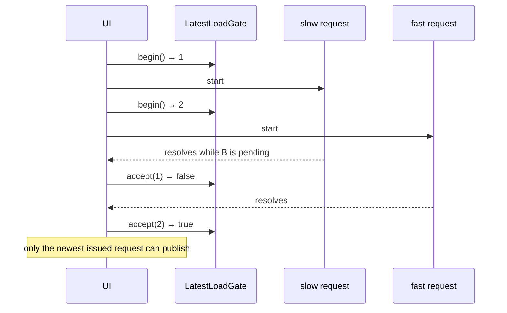

# Progressive asynchronous loading

Desktop Material paints and reveals its usable application shell before
optional startup work finishes. Expensive repository sections are downloaded
and evaluated only when selected, with loading and failure state contained
inside that section.

Tracked by [issue #82](https://github.com/Ding-Ding-Projects/desktop-material/issues/82).

## Why

The shell needs accounts, repositories, persisted preferences, and the applied
theme before it can render correctly. It does not need to stay blank while the
app:

- enumerates installed external editors through the filesystem and registry;
- recovers an interrupted clone queue;
- refreshes accounts and audits permissions; or
- starts automatic-clone monitoring.

Repository Changes and History are normal landing surfaces. Seven other
sections bring substantial component trees that a session may never open:
Actions, Releases and Packages, Cheap LFS, Issues, the GitHub API Explorer,
provider triage, and Repository tools.

## Startup boundary

`AppStore.loadInitialState()` remains the correctness boundary for the data
needed to paint a truthful shell. Work which can safely finish after first
interaction runs as isolated deferred steps. One rejection is logged, reported
through non-fatal diagnostics, and placed in notification history without
cancelling its siblings or opening a modal.

The persisted external-editor choice is displayed as cached data while its
availability is checked. This is safe because launching an editor resolves the
actual executable again before opening a file; stale display data cannot cause
the app to run a missing program.

The renderer sends its ready signal from `componentDidMount`, the first
committed shell. It does not wait for an animation frame because hidden Electron
windows can throttle that callback. There is no artificial timeout or delay:
remaining startup work continues behind a small polite status chip while the
rest of the shell is available.

## Deferred repository sections

The seven inactive sections use named asynchronous webpack chunks which point
directly at each surface module. They do not use barrel imports or
`webpackMode: "eager"`. A production renderer build must retain the separate
chunks; the artifact itself is a verification gate against accidentally pulling
heavy inactive surfaces back into the initial renderer path.

`LazyView` owns three states:

| State | Markup | Behavior |
| --- | --- | --- |
| Loading | `role="status"`, `aria-live="polite"`, `aria-busy="true"` | Announces the named surface politely and never moves focus. |
| Ready | No wrapper element | Renders the resolved surface directly. A stable loader is cached for the renderer session, so revisiting it is synchronous and does not flash progress. |
| Failed | `role="alert"` | Names the surface, includes the original error, and retains a **Try again** button. |

Both a loader rejection and an exception thrown while rendering a resolved
surface stay inside the same local boundary. A retry forgets a cached result,
starts the exact loader again, and creates a fresh nested render boundary. A
failed load is never cached, so retry cannot replay a rejected promise forever.

Each accepted failure is logged and offered to the owner once for a persistent,
non-blocking notification. Nothing about a deferred section failure requires an
immediate decision, so the modal popup stack remains untouched and every other
part of the window stays usable.

## Deferred repository inventories

Submodule and subtree inventories are used only by Repository tools. Their Git
queries begin when that section becomes active, not when the repository view
mounts. Leaving the section aborts both probes while retaining the last verified
counts for a later visit. Changing repository or unmounting aborts and clears
them.

The `AbortSignal` travels through Dispatcher, AppStore, and the Git helpers so
navigation can stop the underlying work, not merely ignore its result. The view
also checks the repository identity and active section before publishing. A
failure remains local and retryable; a previously verified count stays visible
while a refresh runs or fails.

## Race and lifecycle guarantees

`app/src/lib/progressive-load.ts` centralizes newest-request-wins ordering.

- `LatestLoadGate.accept(token)` succeeds only when `token` is the newest
  request issued and has not already been accepted.
- `ProgressiveLoad.run()` never rejects. A source rejection resolves to a
  `failed` state carrying the real `Error`, so launching it with `void` cannot
  produce an unhandled rejection.
- `reset()` advances the generation and refuses every completion from the
  previous subject. `dispose()` permanently refuses later results.
- A verified value can remain available during a refresh and after a failed
  refresh.

The same contract fences a surface swap, rapid repository A → B → A
navigation, and an external-editor selection changed while discovery is still
running.

## Language modes and funny levels

`lazyView.loading` and `lazyView.failedBody` are three-band key families. The
per-language funny-level sliders style their voice in English and playful Hong
Kong-style Cantonese independently, while every band still names the affected
surface.

The failure title, original error detail, retry action, and notification facts
do not vary by funny level. Humour changes voice, never what happened or what
the user can do.

## Accessibility

- Loading is announced politely without changing focus.
- Failure uses `role="alert"` and remains keyboard reachable without moving
  focus.
- The spinner animation is neutralized under
  `prefers-reduced-motion: reduce` and
  `body[data-dm-motion='reduced']`.
- The retry control uses the standard Material button, focus ring, and hit
  target.
- Long localized names and raw error text wrap inside the surface instead of
  clipping it.

## Configuration

None. There is no threshold, delay, or timer to tune.

## Failure modes

| Failure | Result |
| --- | --- |
| A deferred startup step rejects | Logged and reported as a non-fatal startup failure; sibling steps continue and the shell stays usable. |
| A section chunk or renderer fails | Local alert with the real error and retry, plus a persistent non-blocking notification. |
| A submodule or subtree probe fails | Local retry state retains any verified count; the rest of the repository remains interactive. |
| An out-of-order response arrives | Rejected by the generation gate even if a newer request is still pending. |
| Navigation or unmount occurs | Abortable work is cancelled and every late completion is fenced. |

## Verification

| Suite | Covers |
| --- | --- |
| `app/test/unit/progressive-load-test.ts` | Both stale-completion orders, reset, disposal, cached refresh state, rejection normalization, and the no-timer contract. |
| `app/test/unit/ui/lazy-view-test.tsx` | Polite loading, focus retention, render containment, real error copy, retry, cached revisits, shared in-flight loads, surface swaps, and unmount fencing. |
| `app/test/unit/progressive-startup-test.ts` | Startup boundaries, direct asynchronous chunk wiring, deferred Repository tools inventories, and signal propagation. |
