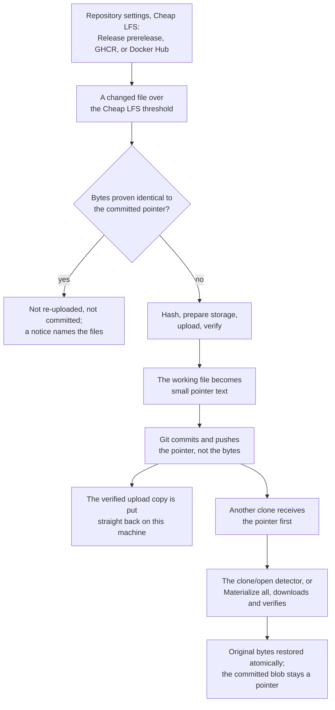
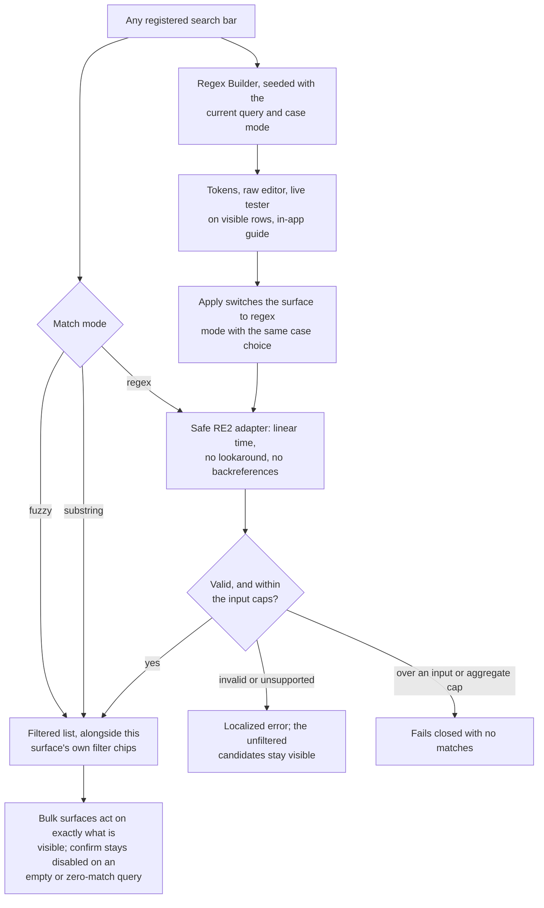

[Overview](app-doc://article/desktop-material.repository.b335630551682c19) · [Install](app-doc://article/desktop-material.repository.1e1a5fc33dbd396e) · [Features](app-doc://article/desktop-material.repository.d2e40a408df25474) · **Complete list** · [Screenshots](app-doc://article/desktop-material.repository.5427e8e90f762374) · [Roadmap & receipts](app-doc://article/desktop-material.repository.78d607cf57dbb567) · [Development](app-doc://article/desktop-material.repository.4cbde0f6e291fe79)

Tabbed README — GitHub can't run scripts, so each tab above is a separate page.

# Complete feature list / 完整功能清單

Every feature Desktop Material ships, grouped by area, with an honest label for
how each one relates to upstream [GitHub
Desktop](https://github.com/desktop/desktop). The [Features](app-doc://article/desktop-material.repository.d2e40a408df25474) tab is
the prose tour; this page is the exhaustive checklist.

Desktop Material 出貨嘅每一個功能，按範疇分組，仲會老老實實話你知每項同上游
[GitHub Desktop](https://github.com/desktop/desktop) 有咩分別。[Features](app-doc://article/desktop-material.repository.d2e40a408df25474)
分頁係散文導覽，呢一頁就係逐項點名嘅完整清單。

> **This page is the single source of truth.** It is one Markdown file. The
> GitHub Pages build renders every `docs/**/*.md` to HTML, so the project site
> publishes this exact file at `readme-tabs/complete-feature-list.html` — the
> README tab and the Pages page can never drift apart.
>
> **呢一頁係唯一嘅真相來源。** 得一個 Markdown 檔。GitHub Pages 建置會將
> `docs/**/*.md` 全部轉做 HTML，所以網站出嘅就係呢個檔本身，README 分頁同 Pages
> 版本冇可能各自走樣。

## How to read the comparison / 點睇個對照

Every row carries one of three labels. Each label is defined once here, then
used as a short token in the tables so rows stay narrow and scannable.

每一行都有以下三個標籤之一。標籤喺呢度定義一次，之後表格入面淨係用個短碼，等每
行都夠窄、夠易掃。

| Label | Meaning | 意思 |
| --- | --- | --- |
| **Added** | The capability has no counterpart in GitHub Desktop. | GitHub Desktop 根本冇呢樣嘢，係呢個分支新加。 |
| **Extended** | GitHub Desktop has a comparable surface; Desktop Material changed, deepened, or rebuilt it. | GitHub Desktop 有類似嘅嘢，但呢度改咗、加深咗，或者重新砌過。 |
| **Inherited** | Works the way GitHub Desktop works. | 同 GitHub Desktop 一樣咁運作，冇改。 |

Where the upstream behaviour was uncertain, the row is labelled **Extended** or
**Inherited** rather than **Added**. This list would rather understate the fork
than overstate it.

如果上游到底有冇某個功能唔敢肯定，嗰行就會標做 **Extended** 或者 **Inherited**，
唔會亂咁標 **Added**。呢張清單寧願講少啲，都唔想吹大個分支。

### At a glance / 一眼睇晒

**201** features across **17** areas:

**17** 個範疇、合共 **201** 項功能：

| Label | Count | Share | 意思 |
| --- | ---: | ---: | --- |
| **Added** | 134 | 66.7% | New in Desktop Material · Desktop Material 新加 |
| **Extended** | 51 | 25.4% | Rebuilt or deepened · 重砌或者加深咗 |
| **Inherited** | 16 | 8.0% | Same as GitHub Desktop · 同 GitHub Desktop 一樣 |

### What this list is counted from / 啲數字點嚟

Every number below is derived from this repository tree, not from memory:

下面每個數字都係由呢個 repository 嘅檔案樹度數出嚟，唔係靠記憶：

| Number | Where it comes from |
| --- | --- |
| **98** feature documents in **9** categories | `docs/features/**/*.md`, excluding the 10 `README.md` indexes |
| **51** searchable collection surfaces | `SearchSurfaceRegistry` in `app/src/lib/collection-surface-registry.ts` |
| **13** bulk-action surfaces | `BulkActionSurfaceRegistry` in the same file |
| **87** command-palette commands in **6** groups | `CommandPaletteCatalog` in `app/src/lib/command-palette-catalog.ts` |
| **19** `.gitignore` templates | `templateMeta` in `app/src/lib/gitignore/catalog.ts` |
| **117** UI feature directories | immediate subdirectories of `app/src/ui/` |
| **3,071** English / **3,047** Cantonese translation keys | `englishTranslations` and `cantoneseTranslations` in `app/src/lib/i18n-resources.ts` |

---

## 1. Material Design 3 shell and appearance / Material Design 3 外殼同外觀

| Feature / 功能 | vs. Desktop | Docs |
| --- | --- | --- |
| **Material Design 3 (M3 Expressive) shell** — the entire application chrome rebuilt on M3 tokens, typography, shape, elevation, and motion.**Material Design 3（M3 Expressive）外殼** — 成個應用程式外框用 M3 嘅 token、字體、形狀、陰影同動效重新砌過。 | **Added** | [Design system](app-doc://article/desktop-material.repository.903bfdd22c351c0c) |
| **Navigation rail** — left icon rail for Changes (with badge), History, Branches, Settings, and the account avatar.**導航側欄** — 左邊圖示欄，有 Changes（連數字標記）、History、Branches、設定同帳戶頭像。 | Extended | — |
| **Floating pill toolbar** — repository and branch chips, a colour-coded CI result, and a sync pill with an ahead badge.**浮動藥丸工具列** — 倉庫同分支 chip、有顏色嘅 CI 結果，同埋帶 ahead 標記嘅同步藥丸。 | Extended | — |
| **Measured toolbar overflow** — measures the real lane and ellipsis pressure, then moves Build & Run and Commit & Push into a **More** surface before labels clip.**識量度嘅工具列收納** — 實測可用闊度同縮字壓力，喺文字被切之前將 Build & Run 同 Commit & Push 收入 **More**。 | **Added** | — |
| **Elevated workspace cards** — floating radius-24 surfaces with tri-state checkboxes, tonal status chips, and token-based diff colours.**升起嘅工作區卡片** — 浮起、圓角 24 嘅表面，有三態勾選框、色調狀態 chip 同 token 化嘅 diff 顏色。 | Extended | — |
| **Animated theme reveal + Material ripple** — bounded ripple feedback and an animated light/dark transition.**主題揭示動畫 + Material 漣漪** — 有界限嘅漣漪回饋，同埋明暗主題嘅過場動畫。 | **Added** | [Ripple and theme reveal](app-doc://article/desktop-material.repository.e52776950bc06a05) |
| **Light / dark / system theme** — the theme choice itself.**淺色／深色／跟系統主題** — 主題選擇本身。 | Inherited | — |
| **Per-element appearance editors** — `Shift`+right-click a real visual owner (or focus it and press the Context Menu key / `Shift+F10`) to open its editor beside that element: workspace, toolbar, repository list, tab strip, diff surface, per-repository name and logo, per-tab title. Ordinary right-click remains available for contextual commands.**逐個元素嘅外觀編輯器** — 撳住 `Shift` 再右擊真正嗰件嘢（或者 focus 住撳 Context Menu 掣／`Shift+F10`），就喺佢隔籬開編輯器：工作區、工具列、倉庫清單、分頁列、diff 表面、每個倉庫嘅名同 logo、每個分頁標題；普通右擊照開功能選單。 | **Added** | [Owner-scoped appearance](app-doc://article/desktop-material.repository.e147738cd2352a08) |
| **Git-backed appearance history** — every appearance owner has its own `setting.json` in its own local Git repository, with lazy diffs, undo, redo, restore, and audit commits.**Git 撐住嘅外觀歷史** — 每個外觀擁有者喺自己嘅本機 Git repo 有一個 `setting.json`，可以睇 diff、undo、redo、還原，改動仲會記低審計 commit。 | **Added** | [Owner-scoped appearance](app-doc://article/desktop-material.repository.e147738cd2352a08) |
| **Repository logo studio** — a vector logo editor with bounded JSON import/export and code-native layers.**倉庫 logo 工作室** — 向量 logo 編輯器，可以有界限咁匯入匯出 JSON，圖層係原生程式碼。 | **Added** | — |
| **UI font customization** — family from installed plus bundled faces, size scale, and weight, with CJK-safe fallback.**介面字型自訂** — 可以揀已安裝同內附嘅字體、字級同字重，中文字有安全後備。 | **Added** | — |
| **Density control** — comfortable and compact, respected by toolbar measurement.**密度控制** — 舒適同緊湊兩種，工具列量度亦都會跟。 | **Added** | — |
| **UI scale slider 50–200% + auto-fit** — scales the interface and shrinks it to fit smaller windows, composing with `Ctrl` `+` / `-` / `0`.**介面縮放滑桿 50–200% + 自動貼合** — 可以縮放介面，細窗都自動縮到啱，同 `Ctrl` `+` / `-` / `0` 一齊用都得。 | Extended | — |
| **Material re-tint of stock surfaces** — tooltips, menus, banners, autocomplete popups, segmented controls, split-buttons, dialog internals, History/CI surfaces in both themes.**原有表面全面 Material 化** — 提示、選單、橫額、自動完成彈出、分段控制、分裂按鈕、對話框內部、History／CI 表面，明暗兩個主題都做齊。 | Extended | — |
| **Universal button hint** — every button exposes a hover and keyboard-focus hint from its help text, accessible name, or label, including icon-only buttons mounted later.**所有按鈕都有提示** — 每個按鈕都由說明文字、無障礙名或者標籤生出 hover 同鍵盤聚焦提示，連遲啲先掛上嘅純圖示按鈕都有。 | Extended | — |
| **Exhaustive responsive gate** — every rail page, preferences tab, repository-settings tab, clone tab, and menu dialog proven reachable at desktop, minimum, narrow, short, wide, 125%, 150%, and 200% scenarios.**全面響應式關卡** — 每一頁側欄、偏好設定分頁、倉庫設定分頁、clone 分頁同選單對話框，喺桌面、最細、窄、矮、闊、125%、150%、200% 都證明到掂到底。 | **Added** | [Responsiveness](app-doc://article/desktop-material.repository.5710a4fd3f19a05a) |

## 2. Language, tone, and audio / 語言、語氣同聲音

| Feature / 功能 | vs. Desktop | Docs |
| --- | --- | --- |
| **Three language modes** — persisted **English**, playful **Hong Kong Cantonese**, or compact **Bilingual**. English is the safe fallback; the Windows locale never silently replaces your choice. 3,071 English and 3,047 Cantonese keys.**三種語言模式** — 會記住嘅**英文**、抵死**香港廣東話**，或者精簡嘅**雙語**。英文係安全後備；Windows 地區設定唔會靜靜雞改咗你嘅選擇。英文有 3,071 個字串鍵，廣東話有 3,047 個。 | **Added** | — |
| **Funny-level sliders (1–5)** — independent playfulness levels for English and Cantonese. Tone changes at every level; the facts never do.**搞笑程度滑桿（1–5）** — 英文同廣東話各有一個。每一級變嘅係語氣，事實永遠唔變。 | **Added** | [Audio system](app-doc://article/desktop-material.repository.6a80bb276d31834c) |
| **Spoken narrator** — optional, off by default, English / Cantonese / both, serialized so utterances never overlap.**語音旁白** — 可選，預設熄咗，英文／廣東話／兩種都得，排住隊講，唔會疊聲。 | **Added** | [Audio system](app-doc://article/desktop-material.repository.6a80bb276d31834c) |
| **Recorded narration and melody assets** — pre-generated per-event voice clips and melody cues replace live speech and synthesis, with automatic fallback.**錄好嘅旁白同旋律素材** — 每個事件都有預先生成嘅語音同旋律，取代即時合成，唔得就自動回退。 | **Added** | [Narration assets](app-doc://article/desktop-material.repository.60e2d5614ce76269) |
| **Distinct sound-effect event mapping** — push/fetch/pull and every Build & Run phase get their own cue across four motif families, with per-category cooldowns and an audition grid in **Settings → Sound**.**唔同事件唔同音效** — push／fetch／pull 同每個 Build & Run 階段都有自己嘅音效，分四個主題家族，每類有冷卻時間，仲可以喺 **設定 → Sound** 試聽。 | **Added** | [SFX event mapping](app-doc://article/desktop-material.repository.320fbc439e3a0c02) |
| **Repository-themed music** — a deterministic synthesized loop seeded from each repository's identity, with per-repo custom-track and mute overrides.**倉庫專屬主題音樂** — 由倉庫身分做種子、確定性合成嘅循環音樂，每個倉庫都可以換歌或者靜音。 | **Added** | [Repository theme music](app-doc://article/desktop-material.repository.f4222f80b74a75ea) |
| **The dim sum surprise** — one launch in ten shows a bundled photograph of a Hong Kong dim sum dish, named in both languages, in a self-clearing corner card. It never gates startup, never takes focus, and has no off switch.**點心驚喜** — 每 10 次開機大概有 1 次，角落彈出一張真點心相，中英文都寫齊個名，自己會收埋。唔阻開機、唔搶焦點，亦冇得熄。 | **Added** | [Dim sum surprise](app-doc://article/desktop-material.repository.7866b4fb2a20d1ac) |
| **Quiet hours, reduced sound, and screen-reader coexistence** — audio ducks under or yields to assistive technology.**安靜時段、減少聲音、同讀屏軟件共存** — 有輔助技術喺度嗰陣，聲音會收細或者讓路。 | **Added** | [Audio system](app-doc://article/desktop-material.repository.6a80bb276d31834c) |

## 3. Repository tabs and windows / 倉庫分頁同視窗

| Feature / 功能 | vs. Desktop | Docs |
| --- | --- | --- |
| **Repository tabs** — browser-like tabs, per account, bound to repositories, with inline rename.**倉庫分頁** — 似瀏覽器嘅分頁，每個帳戶一套，同倉庫綁實，可以就地改名。 | **Added** | [Tab strip](app-doc://article/desktop-material.repository.94bafacfe9e96dcb) |
| **Per-tab title styling** — bold/italic/underline, size, text and background colour, font family, alignment, curated palettes, recent colours, and that tab's own Git history.**逐個分頁標題造型** — 粗體／斜體／底線、字級、文字同背景顏色、字型、對齊，仲有精選色板、最近用色，同埋嗰個分頁自己嘅 Git 歷史。 | **Added** | [Owner-scoped appearance](app-doc://article/desktop-material.repository.e147738cd2352a08) |
| **Tab groups** — named, curated-colour groups with a chip showing name, count, active state, and expanded/collapsed state; mouse, Enter, or Space really hides and restores members.**分頁群組** — 有名有顏色嘅群組，chip 顯示名、數量、活躍狀態同展開／收埋狀態；用滑鼠、Enter 或者 Space 係真係收埋同還原成員。 | **Added** | [Tab groups](app-doc://article/desktop-material.repository.a9ee5c3d57e6d077) |
| **Group persistence boundaries** — groups survive open/close, bulk close, per-window reloads, profile history, and session imports; a group cannot cross the pinned/unpinned boundary; deleting a group never closes its tabs.**群組持久化邊界** — 開關、批量關閉、逐窗重載、設定檔歷史同工作階段匯入之後群組都仲喺度；群組唔可以跨越釘住／未釘住嘅界線；刪群組唔會關咗啲分頁。 | **Added** | [Tab groups](app-doc://article/desktop-material.repository.a9ee5c3d57e6d077) |
| **Pin, favourite, and manual arrange** — drag-and-drop or named keyboard move actions, plus one-shot A→Z, Z→A, newest, oldest, repository-status, and favourites-first/last sorts that keep each named group as one block.**釘住、收藏同手動排列** — 拖放或者具名鍵盤移動，仲有一次過 A→Z、Z→A、最新、最舊、倉庫狀態、收藏優先／最後排序，每個具名群組都當一整嚿咁郁。 | **Added** | [Tab groups](app-doc://article/desktop-material.repository.a9ee5c3d57e6d077) |
| **Fancy drag preview and tab history** — lifted before/after insertion feedback plus a searchable, regex-capable history for restoring recently closed tabs while preserving their presentation.**靚仔拖放預覽同分頁歷史** — 有浮起嘅前／後插入提示，仲有支援搜尋同 regex 嘅歷史，可以還原最近關閉嘅分頁同原本造型。 | **Added** | [Tab groups](app-doc://article/desktop-material.repository.a9ee5c3d57e6d077) |
| **Search tabs / Arrange tabs** — switch by name, alias, path, or clone URL; narrow Arrange with a literal multi-key filter without changing the all-tab scope of one-shot sorts.**搵分頁／排分頁** — 用名、別名、路徑或者 clone URL 切換；Arrange 支援多字面關鍵字篩選，但唔會改變一次過排序嘅全分頁範圍。 | **Added** | [Tab groups](app-doc://article/desktop-material.repository.a9ee5c3d57e6d077) |
| **Close Tabs Containing… and its guarded inverse** — regex close, plus **Close all tabs except those containing…** with live counts, a bounded preview, and no confirm on an empty or zero-match query.**Close Tabs Containing… 同佢有保護嘅反向版** — regex 關閉，仲有 **關閉所有唔含…嘅分頁**，有即時計數同有界限預覽；查詢空白或者零命中就撳唔落確認。 | **Added** | [Collection bulk and regex safety](app-doc://article/desktop-material.repository.af7c9a962ed02bb4) |
| **Tab-strip overflow dropdown** — reach tabs that no longer fit the strip.**分頁列滿瀉下拉選單** — 排唔落嘅分頁都掂得到。 | **Added** | [Tab overflow dropdown](app-doc://article/desktop-material.repository.0e2a4fe18c0273a8) |
| **Tab session export / import** — export the ordered session with pins, favourites, aliases, and per-tab appearance; import preserves the destination profile's existing groups.**分頁工作階段匯出／匯入** — 連次序、釘住、收藏、別名同逐分頁外觀一齊匯出；匯入唔會搞亂目標設定檔原有嘅群組。 | **Added** | [Tab groups](app-doc://article/desktop-material.repository.a9ee5c3d57e6d077) |
| **Drag a folder onto the app** — opens or switches to that repository's tab.**拖個資料夾入 app** — 直接開或者跳去嗰個倉庫嘅分頁。 | Extended | — |
| **Multiple windows** — open repositories or worktrees in separate windows with isolated per-window selection and persisted tabs.**多視窗** — 倉庫或者 worktree 可以開喺唔同視窗，每個窗有自己嘅選擇同記住嘅分頁。 | **Added** | — |

## 4. Accounts and identity / 帳戶同身分

| Feature / 功能 | vs. Desktop | Docs |
| --- | --- | --- |
| **GitHub.com and GitHub Enterprise sign-in** — browser OAuth sign-in.**GitHub.com 同 GitHub Enterprise 登入** — 用瀏覽器 OAuth 登入。 | Inherited | — |
| **Multiple accounts, multiple identities per host** — GitHub Desktop holds one `.com` plus one Enterprise account; Desktop Material holds many, including two identities on the same host, each with its own tabs, repositories, and settings.**多帳戶，同一主機仲可以多身分** — GitHub Desktop 得一個 `.com` 加一個 Enterprise；Desktop Material 可以有好多個，連同一主機兩個身分都得，每個各有自己嘅分頁、倉庫同設定。 | Extended | [Multiple accounts](app-doc://article/desktop-material.repository.0525532389f7683d) |
| **Per-repository account binding** — fetch, pull, push, post-push refresh, scheduled sync, refspec fetch, and remote-HEAD discovery all use the exact selected account. A missing explicit binding fails closed instead of silently borrowing another account.**逐個倉庫綁帳戶** — fetch、pull、push、推完刷新、排程同步、refspec fetch 同遠端 HEAD 探索都用指定嗰個帳戶。冇明確綁定就直接失敗，唔會靜靜雞借第二個帳戶用。 | **Added** | [Multiple accounts](app-doc://article/desktop-material.repository.0525532389f7683d) |
| **GitLab accounts** — including self-hosted endpoints, with a personal access token.**GitLab 帳戶** — 連自架伺服器都得，用個人存取權杖。 | **Added** | [GitLab merge requests](app-doc://article/desktop-material.repository.14a03af71e40a299) |
| **Bitbucket accounts** — with an app password; browse and clone from the provider tab.**Bitbucket 帳戶** — 用 app password；喺供應商分頁瀏覽同 clone。 | **Added** | — |
| **Bounded OAuth scopes** — repository/user access, workflow-file updates, notifications, read-only org membership, and `write:packages`. Repository deletion, package deletion, and administrative scopes stay excluded.**有節制嘅 OAuth 權限** — 倉庫／使用者存取、workflow 檔更新、通知、唯讀組織成員資格，同 `write:packages`。刪倉庫、刪套件同管理類權限一律唔攞。 | Extended | [Cheap LFS OCI](app-doc://article/desktop-material.repository.62007f3b1976de91) |
| **Organization browsing and publishing** — browse complete org repository lists, filter cloning by organization, and choose a personal or organization owner from a non-collapsing, keyboard-operable Publish listbox with fuzzy, substring, and bounded-regex search.**組織瀏覽同發佈** — 睇齊成個組織嘅倉庫清單、按組織篩選 clone，發佈嗰陣仲有唔會縮到隱形、可以用鍵盤操作嘅清單，支援 fuzzy、substring 同有界限 regex，揀個人或者組織做 owner。 | Extended | [Publish organization picker](app-doc://article/desktop-material.repository.ca367cdd6f6b38d0) |
| **Provider triage** — bounded Issue and pull-request summaries for the exact selected GitHub, GitLab, or Bitbucket account, with explicit unavailable, unsupported, partial, and capped states.**供應商分流** — 針對揀咗嗰個 GitHub／GitLab／Bitbucket 帳戶顯示有界限嘅 Issue 同 PR 摘要，唔可用、唔支援、部分同上限狀態都寫得清清楚楚。 | **Added** | — |
| **Credential-prompt FIFO** — concurrent host-key, passphrase, password, and generic authentication requests queue recoverably instead of being dropped by popup de-duplication.**憑證提示先入先出佇列** — 同時嚟嘅 host-key、passphrase、密碼同一般驗證請求會排隊，唔會俾彈窗去重機制食咗。 | **Added** | [Responsiveness](app-doc://article/desktop-material.repository.5710a4fd3f19a05a) |
| **GitHub CLI push credential fallback** — a refused org-remote push automatically retries through `gh auth git-credential`.**GitHub CLI 推送憑證後備** — 組織遠端推唔到嗰陣，自動用 `gh auth git-credential` 再試一次。 | **Added** | [gh CLI push fallback](app-doc://article/desktop-material.repository.e72e8afa4618ae24) |

## 5. Repository management / 倉庫管理

| Feature / 功能 | vs. Desktop | Docs |
| --- | --- | --- |
| **Clone, add local, create repository** — the core repository entry points.**Clone、加入本機、建立倉庫** — 基本嘅入口。 | Inherited | — |
| **Rich clone dialog cards** — description, language, stars, forks, size, default branch, last updated, a visibility pill, and data-derived language filter chips.**豐富嘅 clone 對話框卡片** — 描述、語言、星數、fork 數、大細、預設分支、最後更新、可見度標籤，仲有由資料生出嘅語言篩選 chip。 | Extended | [Clone dialog metadata](app-doc://article/desktop-material.repository.c2ee686d812d13b6) |
| **Multi-clone queue** — organization chips, parallel or sequential modes, URL-only import/export, and a mixed-state select-all checkbox.**多重 clone 佇列** — 組織 chip、並行或者順序模式、淨係 URL 嘅匯入匯出，同埋混合狀態嘅全選勾選框。 | **Added** | — |
| **Pause, resume, and recover clones** — including after restart or an interrupted process. A bounded atomic recovery journal revalidates the destination, clean worktree, `HEAD`, and matching origin without deleting occupied folders.**暫停、繼續同復原 clone** — 連重開程式或者中途斷咗都得。有界限嘅原子復原日誌會重新驗證目的地、乾淨 worktree、`HEAD` 同 origin，唔會刪咗有嘢嘅資料夾。 | **Added** | — |
| **Clone queue settings** — each signed-in account's base directory, parallel/sequential mode, and enabled state stay discoverable in **Settings → Clone queue** after the dialog closes.**Clone 佇列設定** — 每個已登入帳戶嘅基底目錄、並行／順序模式同啟用狀態，對話框閂咗之後喺 **設定 → Clone queue** 一樣搵得返。 | **Added** | [Clone queue settings](app-doc://article/desktop-material.repository.ee316b6294a7c2d1) |
| **Background auto-clone** — opt in to clone only newly discovered repositories, without an unsolicited progress dialog.**背景自動 clone** — 可以選擇淨係自動 clone 新發現嘅倉庫，唔會無端彈個進度對話框出嚟。 | **Added** | — |
| **Credential-free private clone from a plain HTTPS URL** — when an eligible signed-in account matches the exact origin. Only authentication or not-found ambiguity may try another exact-origin account; SSH, cross-origin, and tokenless bindings never widen the fallback.**用普通 HTTPS URL clone 私有倉庫唔使入密碼** — 前提係有已登入帳戶啱晒個 origin。淨係驗證失敗或者 not-found 先會試同 origin 嘅另一個帳戶；SSH、跨 origin 同冇權杖嘅綁定唔會擴大後備範圍。 | Extended | — |
| **Parent-folder repository discovery** — **File → Add local repository → Auto-detect repositories…** scans one folder with bounded, link-safe traversal and adds the reviewed set together.**上層資料夾倉庫探索** — **File → Add local repository → Auto-detect repositories…** 用有界限、唔會亂跟連結嘅方式掃一個資料夾，將審過嘅一批一次過加入。 | **Added** | [Parent-folder discovery](app-doc://article/desktop-material.repository.7d3bf3bf6c643871) |
| **Repository list filter and alias** — text filter and per-repository alias.**倉庫清單篩選同別名** — 文字篩選同逐個倉庫改別名。 | Inherited | — |
| **Pinning, grouping, hiding, and favourites** — pin repositories into a dedicated top group, group them, hide them locally with an explicit recovery path, and hide the automatic Recent group from **Settings → Appearance**.**釘住、分組、隱藏同收藏** — 可以將倉庫釘上頂部群組、自訂分組、本機隱藏（有明確嘅復原方法），仲可以喺 **設定 → Appearance** 收埋自動嘅 Recent 群組。 | **Added** | [Repository sidebar and pinning](app-doc://article/desktop-material.repository.428374b789361f09) |
| **Repository picker filters** — combine status, bound account, provider service, and text. Local-only, unavailable-account, and unknown/signed-out scopes are explicit rather than inferred from a host name.**倉庫選擇器篩選** — 狀態、綁定帳戶、供應商服務同文字可以夾埋一齊用。純本機、帳戶唔可用同未知／已登出嘅範圍係明講嘅，唔係靠個主機名亂估。 | Extended | [Picker filters](app-doc://article/desktop-material.repository.57e78e98091176b7) |
| **Private-repository lock badge** — show a separate localized, keyboard-focusable lock only when provider metadata is exactly private, while retaining the fork glyph, custom logo, or ordinary repository icon. Public and unknown metadata make no privacy claim.**私人 repo 鎖仔** — 淨係供應商資料明確話係 private 先顯示獨立、已本地化、鍵盤聚焦得到嘅鎖仔；fork 圖示、custom logo 或普通 repo icon 照樣保留。公開同未知資料唔會亂作私隱聲明。 | **Added** | [Private-repository badge](app-doc://article/desktop-material.repository.47e05da00763ec4d) |
| **Repository list bulk actions** — select the filter-visible rows to fetch, pull, favourite, group, or forget several repositories, with determinate progress, cancel between repositories, and a removal confirmation that never deletes on-disk content.**倉庫清單批量操作** — 揀篩選後見到嗰啲行去 fetch、pull、收藏、分組或者移除，有明確進度、每個倉庫之間可以取消，移除確認亦都唔會刪硬碟上嘅嘢。 | **Added** | [Bulk actions](app-doc://article/desktop-material.repository.e5cb2775faf14912) |
| **Network and WSL repository paths** — retain UNC roots, detect mapped drives and WSL shares, and give offline reconnection guidance.**網絡同 WSL 倉庫路徑** — 保住 UNC 根目錄、認得對應磁碟機同 WSL 共享，離線嗰陣仲會教你點重新連接。 | Extended | [Network and WSL paths](app-doc://article/desktop-material.repository.ae8b8944f23dc774) |
| **Worktree management** — add, lock, move, rename, repair, remove, or prune worktrees.**Worktree 管理** — 新增、鎖定、搬、改名、修復、移除或者清理 worktree。 | **Added** | — |
| **Submodule add and management** — the same GitHub.com, Enterprise, URL, and GitLab/Bitbucket chooser used for cloning, with exact-account credential affinity, safe repository-relative path validation, streamed progress, and real cancellation.**加入同管理 submodule** — 用返 clone 嗰個 GitHub.com／Enterprise／URL／GitLab／Bitbucket 選擇器，保持帳戶憑證對應，驗證安全嘅相對路徑，有串流進度同真正可以取消。 | Extended | [Submodule and subtree](app-doc://article/desktop-material.repository.f6da3dc449113692) |
| **Temporary submodule viewer** — open an initialized child or a changed/new submodule commit read-only in the current workspace. It is never added to the repository list, Recent group, or persisted selection; stale, uninitialized, invalid-Git, traversal, sibling-prefix, and symlink escape targets fail without importing anything.**臨時 submodule 檢視器** — 將已初始化嘅子倉庫或者有改動／新嘅 submodule commit 以唯讀方式喺當前工作區打開。佢唔會加入倉庫清單、Recent 群組或者記住嘅選擇；過期、未初始化、無效 Git、路徑穿越、同級前綴同 symlink 逃逸目標一律失敗，乜都唔會匯入。 | **Added** | [Submodule navigation](app-doc://article/desktop-material.repository.48ae629a01f8642d) |
| **Subtrees** — a full add, pull, push, and split manager beside the submodule tab.**Subtree** — submodule 分頁隔籬有齊 add、pull、push 同 split 嘅管理器。 | **Added** | [Submodule and subtree](app-doc://article/desktop-material.repository.f6da3dc449113692) |
| **Guided sparse checkout** — a three-step **Choose/Adjust/Restore → Review selection → Apply and refresh** cone-mode guide that stays visible above scrolling content, with state-aware empty, invalid, ready, running, and completed guidance.**引導式 sparse checkout** — 三步嘅 **揀／調整／還原 → 審視選擇 → 套用同重新整理** cone 模式導覽，會一直浮喺捲動內容上面，空白、無效、就緒、執行中同完成各有對應指引。 | **Added** | [Sparse checkout](app-doc://article/desktop-material.repository.40833a845e1653bd) |
| **Remote management** — guarded add, rename, update, set-default, and remove for every named remote; rows stack before their name, URL, and controls collapse below a readable width.**遠端管理** — 每個具名遠端都可以受保護咁新增、改名、更新、設做預設同移除；闊度唔夠嗰陣行會疊起，唔會迫到睇唔到名、URL 同控制項。 | Extended | — |
| **Automatic remote URL refresh** — follows a GitHub repository rename or transfer before network work, preserving transport, web origin, unrelated remotes, and deliberately divergent push targets. Scheduled Git fails without opening credential, hook, signing, or SSH prompts.**自動更新遠端 URL** — 做網絡操作之前跟住 GitHub 倉庫嘅改名或者轉移，保住傳輸方式、網頁 origin、無關嘅遠端同故意唔同嘅 push 目標。排程 Git 失敗就失敗，唔會彈憑證、hook、簽署或者 SSH 提示。 | **Added** | [Remote URL refresh](app-doc://article/desktop-material.repository.2473d152a922e985) |
| **Multi-remote fetch sync** — keep **Fetch `<remote>`** for one configured remote, but label the ordinary action **Fetch all remotes** and fetch every configured remote in stable current-first order when more than one exists.**多遠端 fetch 同步** — 得一個已設定遠端就保留 **Fetch `<remote>`**；多過一個就叫 **Fetch all remotes**，按穩定嘅 current-first 次序 fetch 齊所有已設定遠端。 | **Added** | [Multi-remote fetch sync](app-doc://article/desktop-material.repository.e4ed9e19c01ab8f1) |
| **Git hook inspection** — inspect or create exact known client hooks through the effective `core.hooksPath`, without displaying hook contents or absolute paths.**Git hook 檢視** — 透過生效嘅 `core.hooksPath` 檢視或者建立已知嘅客戶端 hook，但唔會顯示 hook 內容或者絕對路徑。 | **Added** | [Hook execution](app-doc://article/desktop-material.repository.d84076629c9a8631) |
| **Per-repo `.gitignore` manager** — **Repository → Manage .gitignore…** auto-suggests templates from your repo's contents, offers a searchable catalog of **19** templates grouped by category, and merges one-click apply/remove plus a raw editor into marked, reversible sections.**逐個倉庫嘅 `.gitignore` 管理器** — **Repository → Manage .gitignore…** 會按倉庫內容自動建議範本，提供可搜尋、分類嘅 **19** 個範本，一撳套用或者移除，同原始編輯器一齊合併成有標記、可還原嘅區塊。 | Extended | — |
| **Global ignore management** — manage the user-level global ignore file.**全域 ignore 管理** — 管理使用者層級嘅全域 ignore 檔。 | **Added** | [Global ignore](app-doc://article/desktop-material.repository.b5e0d15acdb6cc0e) |
| **Repository Tools panel** — patch series, commit rewriting from an explicit plan, commit/tag signing configuration, Git LFS administration, and bounded guided bisect sessions, with diagnostics and results vertically reachable at compact heights.**Repository Tools 面板** — patch series、按明確計劃改寫 commit、commit／tag 簽署設定、Git LFS 管理，同有界限嘅引導式 bisect；就算窗好矮，診斷同結果都掂得到。 | **Added** | — |
| **Patch-series import and export** — preview, validate, export, and apply portable patch sequences without silently changing unrelated work.**Patch series 匯入匯出** — 預覽、驗證、匯出同套用可攜嘅 patch 序列，唔會靜靜雞改咗無關嘅嘢。 | **Added** | [Patch series](app-doc://article/desktop-material.repository.c6a70bdc8f5f55de) |
| **Custom Git command presets** — run allowlisted presets from the app.**自訂 Git 指令預設** — 喺 app 入面執行白名單內嘅預設指令。 | **Added** | [Custom presets](app-doc://article/desktop-material.repository.d39a563605b37bc0) |
| **Permanent discard** — a context-menu option discards changes without sending files to the trash, including untracked files, for large cleanup operations.**永久捨棄** — 右鍵選項可以唔經回收筒直接捨棄改動，連未追蹤檔案都得，方便大規模清理。 | Extended | — |
| **Duplicate-open guard** — prevents opening the same repository twice in conflicting states.**重複開啟防護** — 唔俾同一個倉庫喺互相衝突嘅狀態下開兩次。 | **Added** | [Duplicate-open guard](app-doc://article/desktop-material.repository.09af43151689e789) |
| **Native large-repository handling** — per-repository large mode extends gc/maintenance suppression to status/add/checkout/fetch plus a controlled repack, fail-closed stale-`index.lock` removal, an explicit status-computing state, suspended polling with one persistent notification for deleted repositories, and confirm-class nested-`.git` compression.**原生大倉庫處理** — 逐個倉庫嘅大型模式將 gc／maintenance 抑制延伸到 status／add／checkout／fetch，加上受控 repack、fail-closed 咁清走過期 `index.lock`、明確嘅「計緊狀態」狀態、倉庫被刪就暫停輪詢並保留一個常駐通知，以及需要確認嘅嵌套 `.git` 壓縮。 | **Added** | [Large repositories](app-doc://article/desktop-material.repository.2b48806a2002fd87) |

## 6. Commits, history, branches, and stashes / Commit、歷史、分支同暫存

| Feature / 功能 | vs. Desktop | Docs |
| --- | --- | --- |
| **Stage by file, hunk, or line; commit; amend; undo** — the core commit workflow.**按檔案、hunk 或者行暫存；commit；修改；復原** — 核心 commit 流程。 | Inherited | — |
| **Co-authors, revert, cherry-pick, squash, and reorder** — the existing commit-manipulation set.**共同作者、revert、cherry-pick、squash 同重新排序** — 原有嘅 commit 操作組合。 | Inherited | — |
| **Effective Git author disclosure** — the commit composer can show the effective author name/email plus the winning config scope and file before you commit.**顯示實際 Git 作者** — commit 之前，撰寫框可以話你知實際嘅作者名／電郵，同埋邊個 config 範圍同檔案贏咗。 | **Added** | — |
| **Copilot commit-message controls** — generate and control commit messages through Copilot.**Copilot commit 訊息控制** — 用 Copilot 生成同控制 commit 訊息。 | Extended | [Copilot controls](app-doc://article/desktop-material.repository.99eb09bc535a4de8) |
| **History search and dedicated lane graph page** — search by title, message, tag, or hash, and open the full-width Graph repository page to visualize commit ancestry.**歷史搜尋同獨立分道圖頁面** — 用標題、訊息、tag 或者 hash 搜尋，再開全闊度 Graph 倉庫頁面睇 commit 血統。 | Extended | [Advanced history](app-doc://article/desktop-material.repository.00dfdff70a3b129d) |
| **Advanced history discovery** — page commits across local branches, remote-tracking branches, and tags, inspecting remote-only commits while keeping cross-ref history read-only.**進階歷史探索** — 跨本機分支、遠端追蹤分支同 tag 分頁瀏覽 commit，睇得到淨係喺遠端嘅 commit，而跨 ref 嘅歷史保持唯讀。 | Extended | [Advanced history](app-doc://article/desktop-material.repository.00dfdff70a3b129d) |
| **Selection-aware commit context menu** — right-click a History commit, or press **More actions**, the Context Menu key, or `Shift+F10`, for reset, checkout, reorder, revert, branch, tag, cherry-pick, copy, and provider actions.**跟住選擇變化嘅 commit 右鍵選單** — 喺 History 右擊、撳 **More actions**、Context Menu 鍵或者 `Shift+F10`，就有 reset、checkout、重排、revert、開分支、開 tag、cherry-pick、複製同供應商操作。 | Extended | — |
| **Merge commits in History** — a distinct, subdued italic summary so integration points are easy to scan.**History 入面嘅 merge commit** — 用低調斜體摘要，一眼就掃到邊度係整合點。 | **Added** | — |
| **File history** — per-file commit history.**檔案歷史** — 逐個檔案嘅 commit 歷史。 | Extended | — |
| **Stashing** — save work in progress.**暫存** — 儲起做緊嘅嘢。 | Inherited | — |
| **Selective stashes** — stash only an exact reviewed set of whole changed files, with repository-bound path validation.**選擇性暫存** — 淨係暫存審過嘅指定整個檔案，路徑會綁住倉庫驗證。 | Extended | [Selective stashes](app-doc://article/desktop-material.repository.8292b08341cbbcd3) |
| **Named multi-stash manager** — create, inspect, apply, pop, rename, branch from, or delete an exact object-identified stash while retaining partial-failure context.**具名多重暫存管理器** — 對指定物件 ID 嘅暫存做建立、檢視、套用、pop、改名、開分支或者刪除，部分失敗嘅情況都保留返上下文。 | Extended | [Named stash manager](app-doc://article/desktop-material.repository.1e68f3b3676b0c0d) |
| **Stash export and recovery dialog** — search every stash, select any number of entries, copy exact snapshots to a directory or ZIP, or configure 7z methods, levels, dictionaries, match finders, fast bytes, solid blocks, threads, split volumes, passwords, and encrypted headers.**暫存匯出同復原對話框** — 搜尋所有 stash，任揀幾多都得；可以複製精確 snapshot 去目錄／ZIP，或者調校 7z 方法、級別、字典、配對搜尋器、快速 bytes、solid、執行緒、分拆 volumes、密碼同 header 加密。 | Added | [Stash export](app-doc://article/desktop-material.repository.a2a6ad5e95ba69fd) |
| **External stash interoperability** — inspect and safely apply, restore, branch from, or explicitly discard stashes made by other Git clients without rewriting their metadata.**外部暫存互通** — 由其他 Git 客戶端整嘅暫存都可以安全咁檢視、套用、還原、開分支或者明確捨棄，唔會改寫佢哋嘅中繼資料。 | Extended | [External stashes](app-doc://article/desktop-material.repository.ca79245d073e1bdd) |
| **Branch create, rename, delete, switch, and merge** — the core branch workflow with conflict resolution.**分支建立、改名、刪除、切換同合併** — 核心分支流程，連衝突解決。 | Inherited | — |
| **Reviewed bulk branch deletion** — select exact local branch tips, protect current/default/remote refs, and retain per-branch recovery IDs.**經審視嘅批量刪分支** — 揀清楚邊啲本機分支 tip，保護當前／預設／遠端 ref，每條分支都留低復原 ID。 | Extended | [Bulk branch deletion](app-doc://article/desktop-material.repository.29ffe063651d3116) |
| **Branch pin, hide, solo, and restore** — plus branch presets and default-branch controls.**分支釘住、隱藏、獨顯同還原** — 仲有分支預設同預設分支控制。 | **Added** | [Branch switcher](app-doc://article/desktop-material.repository.7a3a275662f542fe) |
| **Branch sorting** — by last activity or alphabetically, from **Settings → Appearance**.**分支排序** — 喺 **設定 → Appearance** 揀最後活動時間或者字母序。 | **Added** | [Branch switcher](app-doc://article/desktop-material.repository.7a3a275662f542fe) |
| **Publish indicator for local-only branches** — including branches whose configured upstream was deleted.**純本機分支嘅發佈指示** — 連上游被刪咗嗰啲分支都認得。 | Extended | — |
| **Merge-tree conflict preview** — see the exact conflicting paths before a merge changes the worktree.**Merge-tree 衝突預覽** — merge 未改 worktree 之前就睇到邊啲路徑會撞。 | Extended | — |
| **Reviewed ordinary pull previews** — fetch, then review the exact current/upstream object IDs, ahead/behind state, integration route, and bounded incoming commits and files before Git touches a clean worktree. Confirmation revalidates the reviewed OID and integrates without a second fetch; a failed fetch cannot surface stale tracking data.**經審視嘅普通 pull 預覽** — 先 fetch，跟住喺 Git 郁乾淨 worktree 之前，睇清楚當前／上游嘅物件 ID、ahead／behind、整合路線同有界限嘅入站 commit 同檔案。確認嗰陣會重新驗證審過嗰個 OID 再整合，唔使再 fetch 一次；fetch 失敗就唔會攞舊資料出嚟呃你。 | Extended | [Pull previews](app-doc://article/desktop-material.repository.787dc7a935c4418c) |
| **Deleted-upstream pull recovery** — when Git classifies a pull as missing its configured upstream and the exact remote confirms the branch is gone, offer a reviewed switch to the default branch. Optional local-branch deletion starts off, names any stranded commits, never deletes remotely, and reports the real retry through notifications.**上游分支被刪後嘅 pull 復原** — Git 話 pull 用嗰條上游唔見咗，而且精確遠端亦證實分支已刪，先提供經審視嘅切換到預設分支。可選本機刪分支每次都預設關閉，會講清楚有幾多 commit 可能留低，永遠唔刪遠端，重試真結果由通知交代。 | **Added** | [Deleted-upstream recovery](app-doc://article/desktop-material.repository.b9b28a7d78d6b03c) |
| **Reviewed rebase onto a searched target** — a current→target summary with ahead/behind context and a bounded commit preview. Fresh preflight blocks dirty or conflicted repositories, exact refs are revalidated before Git starts, and Desktop Material never force-pushes automatically.**經審視、可搜尋目標嘅 rebase** — 有 current→target 摘要、ahead／behind 上下文同有界限嘅 commit 預覽。事前檢查會擋住有未提交改動或者衝突嘅倉庫，Git 開始前會重新驗證 ref，而且 Desktop Material 永遠唔會自動 force-push。 | Extended | — |
| **Reviewed batch repository sync** — pull active branches or fetch only, across an exact reviewed subset, with bounded concurrency and isolated results.**經審視嘅批量倉庫同步** — 喺審過嘅指定子集上 pull 活躍分支或者淨係 fetch，並行度有上限，結果各自獨立。 | **Added** | [Batch sync](app-doc://article/desktop-material.repository.85395bec84832fce) |
| **Pull all repositories** — from the repositories sheet with per-repository results; an ambiguous HTTPS authentication or not-found response can retry every remaining token-bearing account for that exact origin without displaying an identity or token.**一次過 pull 所有倉庫** — 喺倉庫側頁做，逐個倉庫有結果；HTTPS 驗證或者 not-found 曖昧嗰陣，可以用同 origin 嘅其他有權杖帳戶再試，但唔會顯示身分或者權杖。 | **Added** | — |
| **Deepen or unshallow** — from History or Repository Tools, with the same exact-origin credential trampoline and bounded signed-in-account recovery.**加深或者取消淺 clone** — 喺 History 或者 Repository Tools 做，用返同 origin 嘅憑證 trampoline，同有界限嘅已登入帳戶復原。 | **Added** | — |
| **Tag creation** — create tags on commits.**建立 tag** — 喺 commit 上開 tag。 | Inherited | — |
| **Complete tag lifecycle** — inventory, create, move, sign, push, fetch, prune, and explicitly delete local and remote tags through stale-safe reviewed operations with recovery receipts.**完整 tag 生命週期** — 盤點、建立、移動、簽署、推送、抓取、清理，同明確刪除本機同遠端 tag，全部經過防過期嘅審視流程，仲有復原憑據。 | Extended | [Tag lifecycle](app-doc://article/desktop-material.repository.baca3ed18aa437df) |
| **Merge all branches or worktrees** — with per-target progress and Copilot-assisted conflict handling.**合併所有分支或者 worktree** — 逐個目標有進度，衝突仲可以叫 Copilot 幫手。 | **Added** | — |
| **Git operation auto-fix** — a pure classifier recognizes fixable failures (stale `index.lock`, auto-gc/maintenance hang, non-fast-forward push, forbidden org-remote push, detached-HEAD commit) and surfaces a localized one-click **Fix it** action on the transient notice, never force-pushing.**Git 操作自動修復** — 純分類器認得可修復嘅失敗（過期 `index.lock`、auto-gc／maintenance 卡死、非快進 push、組織遠端被拒、detached-HEAD commit），喺短暫通知上出一個本地化嘅一撳 **Fix it**，永遠唔會 force-push。 | **Added** | [Auto-fix](app-doc://article/desktop-material.repository.fff13802c88d23ee) |

## 7. Review and diff / 審閱同差異

| Feature / 功能 | vs. Desktop | Docs |
| --- | --- | --- |
| **Text diffs with syntax highlighting and word diff** — the core diff viewer.**有語法高亮同逐字差異嘅文字 diff** — 核心 diff 檢視器。 | Inherited | — |
| **Image diffs** — 2-up, swipe, onion-skin, and difference modes.**圖片 diff** — 並排、滑動、洋蔥皮同差異模式。 | Inherited | — |
| **Changed-file tree view** — organize nested changed paths as a tree without changing file actions.**變更檔案樹狀檢視** — 將巢狀路徑用樹狀整理，但唔改檔案操作。 | Extended | [Changed-file tree](app-doc://article/desktop-material.repository.a1bfa0cac4a9cb2e) |
| **Expanded diff context** — expand surrounding context and persist bounded context-expansion preferences.**擴展 diff 上下文** — 展開周圍嘅上下文，仲會記住有界限嘅展開偏好。 | Extended | [Expanded context](app-doc://article/desktop-material.repository.cc50cf684fe46d2f) |
| **Structured CSV and TSV diffs** — review bounded tabular changes as an accessible table, with deterministic fallback.**結構化 CSV 同 TSV diff** — 用無障礙表格審視有界限嘅表格改動，唔掂就有確定嘅回退。 | **Added** | [Structured diffs](app-doc://article/desktop-material.repository.7bd95da03cf97c13) |
| **TGA image previews** — supported TGA files render as ordinary image diffs.**TGA 圖片預覽** — 支援嘅 TGA 檔當普通圖片 diff 咁顯示。 | Extended | [TGA previews](app-doc://article/desktop-material.repository.eab213879b824d74) |
| **SVG diff hardening and display controls** — safer rendering plus explicit display options.**SVG diff 加固同顯示控制** — 更安全嘅呈現，加明確嘅顯示選項。 | Extended | — |
| **Diff tab size** — configurable from **Settings → Appearance**.**Diff tab 闊度** — 喺 **設定 → Appearance** 可以自己揀。 | Extended | — |
| **Sandboxed Markdown previews** — remove capture listeners, cancel deferred scroll work, and release iframe references on unmount.**沙箱 Markdown 預覽** — 卸載嗰陣會移除捕捉監聽器、取消延後嘅捲動工作同釋放 iframe 參照。 | Extended | [Responsiveness](app-doc://article/desktop-material.repository.5710a4fd3f19a05a) |

## 8. Pull requests and collaboration / Pull request 同協作

| Feature / 功能 | vs. Desktop | Docs |
| --- | --- | --- |
| **Pull-request list and branch checkout** — see open pull requests and check one out.**Pull request 清單同分支 checkout** — 睇到開住嘅 PR 並且 checkout。 | Inherited | — |
| **Check runs and CI status** — commit and pull-request check status.**Check run 同 CI 狀態** — commit 同 PR 嘅檢查狀態。 | Inherited | — |
| **In-app pull-request review workspace** — inspect files in a tree, expand diff context, comment, reply, resolve, approve, request changes, and inspect checks against an exact head, without leaving the app.**App 內嘅 PR 審閱工作區** — 用樹狀睇檔案、展開 diff、留言、回覆、解決、批准、要求修改同睇檢查，全部針對指定 head，唔使離開 app。 | **Added** | [PR review workspace](app-doc://article/desktop-material.repository.4bc1b237c93ce928) |
| **In-app pull-request creation** — discover bounded repository templates, review title/body/draft and provider-backed metadata, then create through the exact authenticated account and local head.**App 內建立 PR** — 搵到有界限嘅倉庫範本，審視標題／內文／草稿同供應商中繼資料，再用指定嘅已驗證帳戶同本機 head 建立。 | **Added** | [PR creation](app-doc://article/desktop-material.repository.671cabf14bdf4577) |
| **Pull-request lifecycle** — update metadata, close, reopen, or merge the exact reviewed pull request through a fail-closed lifecycle.**PR 生命週期** — 更新中繼資料、關閉、重開或者合併審過嗰個 PR，流程 fail-closed。 | **Added** | [PR context and actions](app-doc://article/desktop-material.repository.313cd68842b142c6) |
| **Pull-request activity notifications** — route relevant reviews, comments, and failed checks through de-duplicated OS notifications.**PR 活動通知** — 相關嘅審閱、留言同失敗檢查會經去重嘅系統通知送出。 | Extended | [PR notifications](app-doc://article/desktop-material.repository.44417dc9f8631eb2) |
| **Fork branch checkout** — discover a bounded repository network, review an exact fork branch head and Desktop-managed ref, then fetch and checkout with stale-state guards.**Fork 分支 checkout** — 探索有界限嘅倉庫網絡，審視指定 fork 分支 head 同由 Desktop 管理嘅 ref，再喺有防過期保護下 fetch 同 checkout。 | Extended | [Fork checkout](app-doc://article/desktop-material.repository.05badc56dd267ab3) |
| **GitHub Projects workspace** — a bounded read-only Projects v2 snapshot with a capability-aware classic fallback and a sanitized per-repository cache for offline recovery.**GitHub Projects 工作區** — 有界限嘅唯讀 Projects v2 快照，識能力偵測回退到 classic，仲有經過清理嘅逐倉庫快取俾你離線睇。 | **Added** | [Offline Projects](app-doc://article/desktop-material.repository.7bd8362b0d0945f6) |
| **GitHub Issues** — browse, search, filter, inspect, edit, comment on, close, or reopen issues through repository/account-bound review state.**GitHub Issues** — 用綁定倉庫／帳戶嘅審視狀態去瀏覽、搜尋、篩選、檢視、編輯、留言、關閉或者重開 issue。 | **Added** | — |
| **GitLab merge requests** — provider-backed merge-request workflows.**GitLab merge request** — 由供應商支援嘅 merge request 流程。 | **Added** | [GitLab MR](app-doc://article/desktop-material.repository.14a03af71e40a299) |
| **Branch and repository rules** — inspect the effective rules that apply to the current branch.**分支同倉庫規則** — 睇當前分支實際適用嘅規則。 | Inherited | — |

## 9. GitHub Actions, releases, and packages / GitHub Actions、Release 同套件

| Feature / 功能 | vs. Desktop | Docs |
| --- | --- | --- |
| **Actions run browser** — browse runs in the repository rail and filter by workflow, branch, event, and status.**Actions 執行瀏覽器** — 喺倉庫側欄睇 run，可以按 workflow、分支、事件同狀態篩選。 | **Added** | — |
| **Job, step, and log inspection** — inspect jobs and steps, and securely download and search logs.**Job、step 同日誌檢視** — 睇 job 同 step，安全咁下載同搜尋日誌。 | **Added** | — |
| **Re-run all or failed jobs** — from the run view.**重跑全部或者失敗嘅 job** — 喺 run 檢視度做。 | Extended | — |
| **Workflow dispatch with inputs** — trigger a workflow and supply its inputs.**帶輸入嘅 workflow dispatch** — 觸發 workflow 同埋填佢嘅輸入。 | **Added** | — |
| **Cancel workflow runs** — cancel only queued, running, waiting, or pending runs from a Material confirmation that identifies the exact workflow, run, ref, actor, and commit. Identity and cancellable status are revalidated, duplicate submission is prevented, and the view refreshes until GitHub reports a terminal state.**取消 workflow run** — 淨係取消排隊、執行中、等待或者待處理嘅 run，Material 確認框會寫清楚係邊個 workflow、run、ref、觸發者同 commit。身分同可取消狀態會重新驗證，唔會重複送出，之後一路刷新到 GitHub 報終止狀態為止。 | **Added** | — |
| **Actions caches** — list, search, and delete caches. Cache-archive download is labelled unavailable because GitHub exposes no supported download API.**Actions 快取** — 可以列出、搜尋同刪除。快取封存下載標明「唔可用」，因為 GitHub 冇提供受支援嘅下載 API。 | **Added** | — |
| **Actions artifacts** — browse the paginated catalog, search each loaded catalog with fuzzy/substring/safe-regex modes, and download with bounded redirect and digest checks.**Actions 工件** — 分頁瀏覽目錄，用模糊／子字串／安全 regex 模式搜尋已載入嘅目錄，下載嗰陣有轉址上限同摘要校驗。 | **Added** | — |
| **Local GitHub Actions runner** — run workflows locally.**本機 GitHub Actions 執行器** — 喺本機行 workflow。 | **Added** | [Local Actions runner](app-doc://article/desktop-material.repository.579a715c69d5986b) |
| **Repository Releases dashboard** — compare loaded, stable, prerelease, and draft counts; search and status-filter a compact high-zoom catalog proven at 100/125/150/200%; inspect authors, locale-aware 24-hour timestamps, targets, asset types, digests, and download totals; open a verified download or show it in Explorer; create releases publicly in one operation or save drafts; and keep bounded edit, publish, delete, upload, and download workflows.**倉庫 Release 儀表板** — 比較已載入、穩定、預發佈同草稿數量；喺 100／125／150／200% 都證實得到嘅緊湊高縮放目錄入面搜尋同按狀態篩選；睇作者、跟地區嘅 24 小時時間、目標、資產類型、摘要同下載總數；開已驗證嘅下載或者喺檔案總管顯示；一步公開建立 release 或者存做草稿；編輯、發佈、刪除、上載同下載流程都有界限。 | **Added** | [Releases dashboard](app-doc://article/desktop-material.repository.f9564393ee2fdea5) |
| **GitHub Packages explorer** — per-repository package browsing.**GitHub Packages 瀏覽器** — 逐個倉庫睇套件。 | **Added** | [Packages explorer](app-doc://article/desktop-material.repository.2e8e100f04168f0a) |
| **Self-update with build status and release notes** — checks against Desktop Material's own releases, with a downgrade guard.**自動更新，連建置狀態同發行說明** — 對住 Desktop Material 自己嘅 release 檢查，仲有防降級保護。 | Extended | [Automated updates](app-doc://article/desktop-material.repository.f8a07ede004366b4) |

## 10. Cheap LFS — large files without Git LFS / Cheap LFS — 唔使 Git LFS 都放得低大檔

| Feature / 功能 | vs. Desktop | Docs |
| --- | --- | --- |
| **Git LFS administration** — administer Git LFS itself from Repository Tools.**Git LFS 管理** — 喺 Repository Tools 管理 Git LFS 本身。 | Extended | — |
| **Release-backed Cheap LFS** — replace large tracked bytes with a verified GitHub Release pointer; automatic uploads prefer the trusted, isolated `gh api` exact-range transport, with the memory-bounded native path as fallback. Reconciliation scans up to 1,000 assets once, then polls only an exact asset ID and fails closed on an incomplete asset.**Release 撐住嘅 Cheap LFS** — 將大檔嘅位元組換成經驗證嘅 GitHub Release 指標；自動上載優先用受信任、隔離嘅 `gh api` 精確範圍傳輸，記憶體有界限嘅原生路徑做後備。對帳最多掃 1,000 個資產一次，之後淨係輪詢指定資產 ID，資產唔完整就 fail closed。 | **Added** | [Release-backed Cheap LFS](app-doc://article/desktop-material.repository.7362e2a2a9d603f4) |
| **Cheap LFS OCI registry backend** — store the object set as one logical GHCR or Docker Hub image within explicit 4,096-object, 8,192-layer, and 8 MiB metadata bounds. Additions and removals publish a new immutable manifest, reuse unchanged blobs, and retention-tag every historical digest.**Cheap LFS OCI registry 後端** — 將整個物件集當一個邏輯 GHCR 或者 Docker Hub 映像儲存，明確限制 4,096 個物件、8,192 層同 8 MiB 中繼資料。加或者刪都會出一個新嘅不可變 manifest、重用冇變嘅 blob，仲會為每個歷史摘要打保留標籤。 | **Added** | [OCI registry backend](app-doc://article/desktop-material.repository.62007f3b1976de91) |
| **Cheap LFS asset versioning** — every uploaded asset is write-once, so editing a pinned file uploads new bytes as a new asset and every historical commit keeps restoring its own version. Byte-identical content deduplicates on proven provider digests, and the introducing commit is recorded in the pointer.**Cheap LFS 資產版本管理** — 每個上載嘅資產都係一次寫入，所以改一個已釘住嘅檔會上載成新資產，每個歷史 commit 都仲原到自己嗰個版本。位元組相同嘅內容會按供應商摘要去重，指標仲會記低引入嗰個 commit。 | **Added** | [Asset versioning](app-doc://article/desktop-material.repository.367a2e1cc4a8e3d6) |
| **Large files manager** — the repository rail's direct manager lists, searches, pins, and materializes Release- and OCI-backed pointers. It owns the page's vertical scroll so a long inventory stays reachable, and **Open Cheap LFS settings** jumps to **Repository settings → Cheap LFS**.**大檔管理器** — 倉庫側欄嘅直接管理器可以列出、搜尋、釘住同實體化 Release 或者 OCI 撐住嘅指標。佢自己揸住頁面嘅垂直捲動，就算清單好長都掂得到，而 **Open Cheap LFS settings** 會直接跳去 **Repository settings → Cheap LFS**。 | **Added** | [Release-backed Cheap LFS](app-doc://article/desktop-material.repository.7362e2a2a9d603f4) |
| **Automatic preparation with worker lanes** — sequential, or at most three files uploading at once. It cheap-stats the whole reviewed selection before content-proofing only oversized candidates, then reports per-file phases, bytes, worker and queue state, provider context, elapsed time, throughput, and ETA in a keyboard-accessible compact terminal below Commit.**自動準備，有工作通道** — 可以順序做，或者最多三個檔同時上載。佢會先平價咁 stat 成個審過嘅選擇，淨係對超大嘅候選做內容校驗，跟住喺 Commit 下面一個可鍵盤操作嘅精簡終端顯示逐檔階段、位元組、工作者同佇列狀態、供應商上下文、經過時間、吞吐量同 ETA。 | **Added** | [Release-backed Cheap LFS](app-doc://article/desktop-material.repository.7362e2a2a9d603f4) |
| **Cloud compression** — public repository objects compress automatically one at a time; private repositories require explicit opt-in. Only `part-deflate` objects are decompressed on restore.**雲端壓縮** — 公開倉庫嘅物件會逐個自動壓縮；私有倉庫要明確選擇加入。還原嗰陣淨係解壓 `part-deflate` 物件。 | **Added** | [Release-backed Cheap LFS](app-doc://article/desktop-material.repository.7362e2a2a9d603f4) |
| **Private-payload encryption** — private-source chunks use AES-256-GCM with the intentionally tracked shared repository key. Public OCI and public GitHub.com Release pointers can restore while signed out.**私有內容加密** — 私有來源嘅分塊用 AES-256-GCM，鎖匙係刻意追蹤嘅共享倉庫鎖匙。公開 OCI 同公開 GitHub.com Release 指標就算登出都還原到。 | **Added** | [OCI registry backend](app-doc://article/desktop-material.repository.62007f3b1976de91) |
| **Provider migration** — verified materialized files can move between GHCR and Docker Hub as a fresh full snapshot; existing Docker organization and collaborator namespaces are retained.**供應商遷移** — 已驗證實體化嘅檔可以喺 GHCR 同 Docker Hub 之間搬，做一個全新完整快照；原有嘅 Docker 組織同協作者命名空間會保留。 | **Added** | [OCI registry backend](app-doc://article/desktop-material.repository.62007f3b1976de91) |
| **Oversized-file filter and two-lane clone repair** — the Changes filter isolates files over the same 100 MiB threshold, and the default clone/open detector repairs both new and older pointer-only clones through verified local materialization. Release restore uses one shared maximum-two-download coordinator: the next file or part starts at exactly 90%, and detailed overall/current/look-ahead progress distinguishes logical and actual bytes, phases, ordinals, queue, rate, ETA, failures, and cancellation. Combined local tests, production build, and hidden-desktop acceptance pass; remote publication remains separate.**超大檔篩選同雙 lane clone 修復** — Changes 篩選可以隔離超過同一個 100 MiB 門檻嘅檔，而預設 clone／開啟偵測器會用經驗證嘅本機實體化修復新舊純指標 clone。Release 還原成批最多兩個下載；目前檔或者 part 啱啱到 90%，下一個先開工。詳細進度會分邏輯／實際位元組、階段、檔／part 次序、排隊、速度、ETA、失敗同取消。本機測試、正式 build 同 hidden-desktop 驗收已經過關；遠端發佈證據另外計。 | **Added** | [Release-backed Cheap LFS](app-doc://article/desktop-material.repository.7362e2a2a9d603f4) |
| **Automatic commit and push batching** — when many small files approach a decimal 1.5 GB push, Desktop Material creates and pushes commits under a conservative 1.4 GB changed-blob budget, proving each fast-forward remote tip before creating the next commit and retaining a durable retry checkpoint. Ordinary pushes and persistent Git configuration stay unchanged.**自動 commit 同 push 分批** — 好多細檔夾埋逼近十進制 1.5 GB 推送上限嗰陣，Desktop Material 會用保守嘅 1.4 GB 變更 blob 預算分批建立同推送，每次建立下一個 commit 之前都證明遠端 tip 係快進，仲會留低耐用嘅重試檢查點。普通 push 同持久 Git 設定完全唔變。 | **Added** | [Push batching](app-doc://article/desktop-material.repository.6eb182e770051520) |
| **ORAS runtime** — Windows builds ship digest-pinned ORAS 1.3.2 plus its Apache-2.0 licence; the ARM64 package runs that audited x64 binary through Windows 11 x64 emulation and fails closed if it cannot start.**ORAS 執行環境** — Windows 版本內附摘要鎖定嘅 ORAS 1.3.2 同佢嘅 Apache-2.0 授權；ARM64 套件用 Windows 11 x64 模擬行嗰個經審核嘅 x64 執行檔，起唔到就直接 fail closed。 | **Added** | [OCI registry backend](app-doc://article/desktop-material.repository.62007f3b1976de91) |

### The Cheap LFS lifecycle / Cheap LFS 嘅一生

**What the lifecycle diagram says.** Each repository picks one backing store —
a published GitHub prerelease, a GHCR image, or a Docker Hub image. A changed
file over the 100 MiB threshold is prepared at commit time (or pinned by hand
from the **Large files** manager): if its working-tree bytes are *proven*
identical to the pointer the commit already holds, it is neither re-uploaded
nor committed and a notice names it; otherwise it is hashed, uploaded, verified,
and replaced in the working tree by five lines of pointer text. Git only ever
commits and pushes that pointer. On the machine that did the upload the
verified copy is reinstalled straight over the pointer, so nothing is
re-downloaded seconds after being uploaded. Any other clone receives the
pointer first, and the default-on clone/open detector — or **Materialize all**
— downloads, verifies, and atomically restores the original bytes while the
committed blob stays a pointer, so the next clone can repeat the same verified
restore.

**呢張生命週期圖講咩。** 每個倉庫揀一個後端：已發佈嘅 GitHub prerelease、GHCR
映像，或者 Docker Hub 映像。超過 100 MiB 門檻嘅改動檔會喺 commit 嗰陣準備好
（或者你自己喺 **Large files** 管理器手動釘），如果佢工作區嘅位元組**證實**同
commit 入面嗰個指標一模一樣，就唔會再上載、亦唔會 commit，仲會出個通知逐個
點名；否則就 hash、上載、驗證，然後將工作區嗰個檔換成五行指標文字。Git 由頭到
尾淨係 commit 同 push 嗰個指標。喺上載嗰部機度，驗證過嘅副本會即刻裝返落去冚
住個指標，所以啱啱上載完唔使再下載多一次。其他 clone 收到嘅係指標，預設開住
嘅 clone／開啟偵測器 — 或者 **Materialize all** — 會下載、驗證，再原子咁還原
原本嘅位元組，而 commit 咗嘅 blob 仍然係個指標，等下一個 clone 可以照辦煮碗再
還原一次。

## 11. Build & Run and local AI / Build & Run 同本機 AI

| Feature / 功能 | vs. Desktop | Docs |
| --- | --- | --- |
| **One-click Build & Run** — auto-detects bounded, nested project roots and runnable profiles for Node/npm/yarn/pnpm/bun, Deno, Rust, Go, .NET, Python, Java/Kotlin, PHP, Ruby, Swift, Dart/Flutter, Elixir, Scala, Haskell, Zig, Make, and CMake. Each choice shows its project folder so similarly named profiles are unambiguous.**一撳 Build & Run** — 自動偵測有界限嘅巢狀專案根同可執行設定，支援 Node/npm/yarn/pnpm/bun、Deno、Rust、Go、.NET、Python、Java/Kotlin、PHP、Ruby、Swift、Dart/Flutter、Elixir、Scala、Haskell、Zig、Make 同 CMake。每個選項都顯示佢嘅專案資料夾，同名嘅唔會撈亂。 | **Added** | [Build & Run output](app-doc://article/desktop-material.repository.bf2696656cc4d09f) |
| **Install, build, and run in one action** — streaming output to an MD3 log panel with a one-shot **Scroll to bottom**, persisted auto-scroll that pauses when you read history, and persisted display-only long-line truncation that leaves the full text available to **Copy all output**.**安裝、建置同執行一步搞掂** — 輸出串流入 MD3 日誌面板，有一次過 **Scroll to bottom**、會記住嘅自動捲動（你揭返舊嘢就會暫停），同會記住嘅長行截斷（淨係顯示層面截，**Copy all output** 仍然攞到完整文字）。 | **Added** | [Build & Run output](app-doc://article/desktop-material.repository.bf2696656cc4d09f) |
| **Auto-ignore build outputs** — applies the matching `.gitignore` template plus an artifacts section before building.**自動忽略建置輸出** — 建置之前套用啱嘅 `.gitignore` 範本再加一個 artifacts 區塊。 | **Added** | — |
| **Local AI build repair** — bounded auto-fix on failure through a per-repository choice of Codex CLI or OpenCode, with stdin-only prompts, explicit install/auth/auto-approve consent, renderer-owned process-tree cancellation, and a verification rerun unless **Stop** cancels it.**本機 AI 修建置** — 失敗嗰陣可以有界限咁自動修，逐個倉庫揀 Codex CLI 或者 OpenCode，淨係用 stdin 傳提示，安裝／驗證／自動批准都要明確同意，取消時由 renderer 負責清整棵進程樹，除非撳 **Stop**，否則會再跑一次驗證。 | **Added** | [Local AI build fix](app-doc://article/desktop-material.repository.6386d74d302ed035) |
| **Optional single-prompt UAC pre-elevation** — one consent prompt instead of many.**可選嘅單次 UAC 預先提權** — 一次同意，唔使彈完又彈。 | **Added** | [Local AI build fix](app-doc://article/desktop-material.repository.6386d74d302ed035) |
| **Ollama model manager** — add an **Ollama (local)** provider, then inspect endpoint health/version, installed and running inventories, searchable model details, runtime allocation, and capabilities. Pull with streamed progress and cancellation; copy or guarded-rename; load or unload; delete only after confirming the exact model name; and synchronize the installed inventory back to that provider's selectable Copilot models. Management requires an exact loopback `/v1` base.**Ollama 模型管理器** — 加一個 **Ollama（本機）** 供應商，然後睇端點健康／版本、已安裝同執行中嘅清單、可搜尋嘅模型詳情、執行時分配同能力。Pull 有串流進度同取消；可以複製或者受保護咁改名；載入或者卸載；要打啱模型全名先刪得；仲可以將已安裝清單同步返做嗰個供應商可揀嘅 Copilot 模型。管理功能一定要精確嘅 loopback `/v1` 基底。 | **Added** | [Ollama model manager](app-doc://article/desktop-material.repository.d0ba43a29e7c9e23) |

## 12. Automation, agent API, and command line / 自動化、Agent API 同命令列

| Feature / 功能 | vs. Desktop | Docs |
| --- | --- | --- |
| **Scheduled commit-and-push and pull** — configure globally, override per account or repository, with safety guards that skip unsafe repositories and preserve draft commit messages.**排程 commit-and-push 同 pull** — 全域設定，可以逐個帳戶或者倉庫覆寫，安全守衛會跳過唔安全嘅倉庫，仲會保住草稿 commit 訊息。 | **Added** | — |
| **Run commit-and-push immediately** — one-click commit and push with a generated message.**即刻 commit-and-push** — 一撳 commit 同 push，訊息自動生成。 | **Added** | — |
| **Local agent server** — opt-in and token-gated from **Settings → Agent access**, exposing MCP and REST on a random loopback-only port, never returning account credentials.**本機 agent 伺服器** — 喺 **設定 → Agent access** 選擇性啟用，要權杖，喺隨機嘅純 loopback 連接埠開 MCP 同 REST，永遠唔會回傳帳戶憑證。 | **Added** | [Local Agent HTTP API](app-doc://article/desktop-material.repository.01c90ee941d3fae5) |
| **Paired LAN devices** — **Open mobile connection page** replaces any old code and opens a fresh five-minute, one-use pairing link in the default browser. The secret stays in the URL fragment and is never sent to the site server.**配對區域網裝置** — **Open mobile connection page** 會換走舊 code，喺預設瀏覽器開一條新嘅、五分鐘、一次性配對連結。秘密留喺 URL fragment，唔會送去網站伺服器。 | **Added** | [Local Agent HTTP API](app-doc://article/desktop-material.repository.01c90ee941d3fae5) |
| **Stdio proxy and command-line client** — list accounts, repositories, and tabs; inspect status; clone, commit, fetch/pull/push; manage branches and tabs; run automation; and dispatch workflows.**Stdio 代理同命令列客戶端** — 列出帳戶、倉庫同分頁；睇狀態；clone、commit、fetch／pull／push；管理分支同分頁；跑自動化；同埋觸發 workflow。 | **Added** | [Local Agent HTTP API](app-doc://article/desktop-material.repository.01c90ee941d3fae5) |
| **Repository-bound App functions** — turn a validated REST catalog request or named GraphQL operation into a profile-backed function bound to the exact repository, provider, and account. Read functions extend the local MCP/REST catalog; mutation functions always return to the visible review step.**綁定倉庫嘅 App function** — 將經驗證嘅 REST 目錄請求或者具名 GraphQL 操作變成由設定檔支援、綁死倉庫／供應商／帳戶嘅功能。讀取類會加入本機 MCP／REST 目錄；變更類一定要返去可見嘅審視步驟。 | **Added** | [GitHub API functions](app-doc://article/desktop-material.repository.37b172fd362f0357) |
| **GitHub API rail** — run automatically added repository, issues, pull-request, release, and workflow actions as buttons; hide the rail item when unneeded, and reveal the full REST/GraphQL catalog only for advanced custom functions.**GitHub API 側欄** — 將自動加入嘅倉庫、issue、PR、release 同 workflow 操作變成按鈕；唔使就收埋佢，完整 REST／GraphQL 目錄淨係喺整進階自訂功能嗰陣先顯示。 | **Added** | [GitHub API functions](app-doc://article/desktop-material.repository.37b172fd362f0357) |
| **Executable Postman collections** — a category collection for every shipped HTTP route and static command, plus a master project collection, containing no token or machine-specific path.**可執行嘅 Postman 集合** — 每條已出貨嘅 HTTP 路由同靜態指令都有分類集合，仲有一個總集合，入面冇任何權杖或者機器專屬路徑。 | **Added** | [Agent API](app-doc://article/desktop-material.repository.a8a8b30ccefce2b9) |

## 13. Search everywhere and the regex builder / 到處都搵得到，仲有 regex 建構器

| Feature / 功能 | vs. Desktop | Docs |
| --- | --- | --- |
| **Fuzzy / substring / regex filter modes** — every search bar gains all three modes, a case toggle, and per-list filter chips, across **51** registered collection surfaces.**模糊／子字串／regex 篩選模式** — 每個搜尋欄都有呢三種模式、大小寫開關同逐清單嘅篩選 chip，覆蓋 **51** 個已註冊嘅集合表面。 | **Added** | [Regex guide](app-doc://article/desktop-material.repository.082f5137ffa04709) |
| **Safe RE2 regex builder** — anchors, character classes, quantifiers, groups and captures, alternation, the honestly supported ignore-case flag, and a live match/capture tester, reachable from the search bars. Unsupported lookaround and backreferences are explained before Apply.**安全 RE2 regex 建構器** — 錨點、字元類、數量詞、群組同捕捉、交替、老實講支援嘅忽略大小寫旗標，同即時比對／捕捉測試器，喺搜尋欄就開到。唔支援嘅 lookaround 同反向參照喺撳 Apply 之前就會解釋清楚。 | **Added** | [Regex guide](app-doc://article/desktop-material.repository.082f5137ffa04709) |
| **Regex builder reflow** — the builder reflows its category/token grid and scrolls its body while preserving the tester and footer at compact heights.**Regex 建構器重排** — 建構器會重排分類／token 格線同捲動內文，就算窗好矮都保住測試器同頁尾。 | **Added** | [Regex guide](app-doc://article/desktop-material.repository.082f5137ffa04709) |
| **Command palette** — `Ctrl+Shift+F` opens **247** catalog commands across **6** groups (App, Repository, Branch, Navigate, Changes, Edit) with wider rows carrying a leading icon, title, optional search-term line, and localized group chip.**指令面板** — `Ctrl+Shift+F` 開出目錄入面 **247** 個指令，分 **6** 組（App、Repository、Branch、Navigate、Changes、Edit），每行較闊，有前置圖示、標題、可選搜尋字詞行同本地化群組 chip。 | **Added** | [Command palette](app-doc://article/desktop-material.repository.d1cb3cf602dbf0fd) |
| **Command-palette appearance editor** — an anchored **Customize appearance** editor persists comfortable/compact density and independent icon/group/keyword visibility; Escape closes only the editor and restores toggle focus.**指令面板外觀編輯器** — 錨定嘅 **Customize appearance** 編輯器會記住舒適／緊湊密度同圖示／群組／關鍵字嘅獨立顯示設定；撳 Escape 淨係閂編輯器並將焦點還俾開關。 | **Added** | [Command palette](app-doc://article/desktop-material.repository.d1cb3cf602dbf0fd) |
| **Settings search** — find a setting by name, description, or keyword across every Preferences tab and jump straight to its tab. A query in either language matches regardless of display language.**設定搜尋** — 跨所有偏好設定分頁用名、描述或者關鍵字搵設定，一撳跳去嗰個分頁。用邊種語言打都搵到，同顯示語言無關。 | **Added** | [Settings search](app-doc://article/desktop-material.repository.ac030f2c405e3d33) |
| **Browser-style settings tabs** — Global Settings, Repository Settings, and Stash Manager share horizontal tabs with stable identities, close and reopen actions, overflow discovery, linked panels, focus restoration, localized labels, and session-safe persistence that survives filtered searches and stale stored IDs.**似瀏覽器嘅設定分頁** — 全域設定、倉庫設定同 Stash 管理員共用橫向分頁，有穩定身份、關閉同重開、滿瀉搵分頁、連住內容面板、focus 還原、本地化標籤，同埋唔會俾搜尋或舊資料搞亂嘅持久化。 | **Added** | [Browser-style settings tabs](app-doc://article/desktop-material.repository.fc18cdc6bfe1caab) |
| **Settings tab docking** — dock Preferences and Repository Settings tabs on the left, top, bottom, or right, with independent persistence and a left fallback for invalid values.**設定分頁停靠** — Preferences 同 Repository Settings 分頁可以擺左、頂、底或者右邊，各自記住位置；記錄唔啱就返左邊。 | **Added** | [Settings tab docking](app-doc://article/desktop-material.repository.71a7d2433aa53088) |
| **Scheduled language, appearance, and external settings** — apply local values in date/time windows with an every-day option, validated API responses, or Home Assistant boolean gating; failures leave the normal profile settings active.**排程語言、外觀同外部設定** — 喺日期／時間視窗套用本機值，支援每日選項、驗證 API 回應，或者用 Home Assistant 布林狀態控制；來源失敗時照用原本設定。 | **Added** | [Scheduled settings](app-doc://article/desktop-material.repository.17e76ca1604d01a0) |
| **Collection bulk actions with regex safety** — **13** registered bulk-action surfaces share live counts, bounded previews, and a confirm that stays disabled on an empty or zero-match query.**帶 regex 安全嘅集合批量操作** — **13** 個已註冊嘅批量操作表面共用即時計數、有界限預覽，同埋查詢空白或者零命中就撳唔落嘅確認。 | **Added** | [Bulk and regex safety](app-doc://article/desktop-material.repository.af7c9a962ed02bb4) |
| **Repository content search** — search inside repository content.**倉庫內容搜尋** — 喺倉庫內容入面搵嘢。 | **Added** | — |
| **Documentation-hub search** — the project site searches the full documentation catalog in the reader's browser, with the same regex modes.**文件中心搜尋** — 專案網站喺讀者瀏覽器入面搜尋成個文件目錄，用同一套 regex 模式。 | **Added** | [Regex guide](app-doc://article/desktop-material.repository.082f5137ffa04709) |

### The search and regex stack / 搜尋同 regex 嘅疊法

**What the search diagram says.** All 51 registered search bars share one
contract: a mode control cycling fuzzy, contiguous substring, and safe RE2
regex, a case toggle, and that surface's own filter chips. Regex mode compiles
through a pure-JavaScript RE2 adapter — linear time, with lookaround and
backreferences deliberately rejected — so a user-authored pattern cannot freeze
the renderer. The Regex Builder opens from the same bar seeded with the current
query and case mode, offers token categories, a raw editor, a live tester over
the visible rows, and the guide, and applying a pattern switches that surface to
regex mode with the same case choice the preview used. The two failure paths are
different on purpose: an invalid, unsupported, or over-long pattern leaves the
unfiltered candidates on screen with a localized error, while an input-size or
aggregate-size cap fails closed with no matches so a compact list can never
imply a filter is working when it is not. The 13 bulk-action surfaces then act
on exactly what is visible, with live counts, a bounded preview, and a confirm
that stays disabled on an empty or zero-match query.

**呢張搜尋圖講咩。** 全部 51 個已註冊搜尋欄共用同一份契約：一個模式控制輪住轉
模糊、連續子字串同安全 RE2 regex，一個大小寫開關，加埋嗰個表面自己嘅篩選 chip。
Regex 模式係經一個純 JavaScript 嘅 RE2 轉接器編譯 — 線性時間，lookaround 同反
向參照係刻意唔收 — 所以用家自己寫嘅 pattern 冇可能凍死個介面。Regex Builder 就
喺同一個搜尋欄開出嚟，開嗰陣已經帶住當前嘅查詢同大小寫設定，有 token 分類、原
始編輯器、對住見到嗰啲行嘅即時測試器同埋指南；撳 Apply 就會將嗰個表面轉做
regex 模式，連預覽用嗰個大小寫選擇一齊帶過去。兩條失敗路線係故意唔同嘅：無效、
唔支援或者太長嘅 pattern，會留低未篩選嘅候選喺畫面上再出個本地化錯誤；但輸入大
細或者總量超標就直接 fail closed、零命中，等一個細細嘅清單唔會扮到好似篩緊嘢咁
呃你。跟住 13 個批量操作表面就淨係針對你見到嗰啲嘢做嘢，有即時計數、有界限預
覽，查詢空白或者零命中嗰陣個確認掣係㩒唔落嘅。

## 14. Notifications and dialogs / 通知同對話框

| Feature / 功能 | vs. Desktop | Docs |
| --- | --- | --- |
| **Non-modal dialog framework** — dialogs float without blocking the app, drag by their headers, cascade, and can be brought to front; the app stays fully interactive behind an open dialog.**非模態對話框框架** — 對話框浮住又唔會封鎖成個 app，可以拉標題列拖、疊層、提到最前；就算開住對話框，背後嘅 app 一樣用得。 | **Added** | — |
| **Dialog wheel and trackpad scrolling** — mouse-wheel and trackpad gestures scroll from anywhere over dialog content, with nested lists and editors retaining their own range and chaining to the outer body at an edge.**對話框滾輪同觸控板捲動** — 喺對話框內容任何位置都捲得到，巢狀清單同編輯器保住自己嘅範圍，到咗邊界就交俾外層。 | **Added** | [Dialog wheel scrolling](app-doc://article/desktop-material.repository.a82dda5755c15fa7) |
| **Non-blocking error notices** — acknowledgement-only application errors default to dismissible red notices at the bottom right; traditional blocking dialogs remain a choice in **Settings → Notifications**, while errors that require a decision, retry, sign-in, or remediation always stay dialogs.**唔封鎖操作嘅錯誤提示** — 淨係要你「知道咗」嘅錯誤，預設喺右下角出可關閉嘅紅色提示；想要傳統封鎖式對話框可以喺 **設定 → Notifications** 揀，而要你做決定、重試、登入或者補救嘅錯誤永遠都係對話框。 | **Added** | — |
| **Scoped index.lock recovery** — an error naming a stale `.git/index.lock` offers a scoped **Remove lock file** action after Desktop confirms the repository is idle and the lock is old and unchanged.**有範圍嘅 index.lock 復原** — 錯誤指到過期嘅 `.git/index.lock` 嗰陣，Desktop 確認咗倉庫得閒、鎖檔又舊又冇變，先會提供有範圍嘅 **Remove lock file**。 | **Added** | [Auto-fix](app-doc://article/desktop-material.repository.fff13802c88d23ee) |
| **Notification centre** — a bell and right-hand side sheet backed by its own local Git repo: search by title, message, or repository metadata; filter by event type; select all visible results; bulk mark read/unread or delete; and visibly confirm **Clear all**, with every change recoverable from Git-backed history.**通知中心** — 一個鈴同右邊側頁，背後有自己嘅本機 Git repo：用標題、訊息或者倉庫中繼資料搜尋；按事件類型篩選；全選見到嘅結果；批量標示已讀／未讀或者刪除；**Clear all** 要明確確認，而且所有改動都可以由 Git 歷史還原。 | **Added** | — |
| **Live GitHub inbox** — switch to a separate live inbox for any signed-in GitHub.com or Enterprise account; every available 50-item API page is fetched automatically with no 200-item display ceiling. Filter unread/all and participating threads, open only validated provider links, bulk mark read/done, and keep partial failures visible for retry. Remote threads are never copied into the local log.**即時 GitHub 收件箱** — 可以切換去任何已登入 GitHub.com 或者 Enterprise 帳戶嘅獨立即時收件箱；每一頁 50 項嘅 API 都會自動攞晒，冇 200 項顯示上限。可以篩未讀／全部同有參與嘅討論串、淨係開經驗證嘅供應商連結、批量標示已讀／完成，部分失敗會留喺度俾你重試。遠端討論串永遠唔會抄入本機日誌。 | **Added** | — |
| **MD3 Preferences dialog** — rebuilt as a 940×660 dialog with a left rail, an Active chip, and a pill footer.**MD3 偏好設定對話框** — 重新砌成 940×660，有左側欄、Active chip 同藥丸頁尾。 | Extended | — |
| **MD3 side sheets** — repository and branch pickers become side sheets; the clone dialog is restyled to match.**MD3 側頁** — 倉庫同分支選擇器變成側頁，clone 對話框亦都改到配襯。 | Extended | — |

## 15. Editors, shell, and OS integration / 編輯器、Shell 同作業系統整合

| Feature / 功能 | vs. Desktop | Docs |
| --- | --- | --- |
| **External editor discovery and opening** — detect installed editors and open the repository in one.**外部編輯器偵測同開啟** — 偵測已安裝嘅編輯器，一撳用佢開倉庫。 | Inherited | [Editor discovery](app-doc://article/desktop-material.repository.67769fded2ad4460) |
| **Broad editor catalog** — a wider set of supported editors.**更廣嘅編輯器目錄** — 支援嘅編輯器多好多。 | Extended | [Broad editor support](app-doc://article/desktop-material.repository.0ca797463349948f) |
| **One-click editor actions** — open a specific file or location directly.**一撳編輯器操作** — 直接開指定檔案或者位置。 | Extended | [One-click editor actions](app-doc://article/desktop-material.repository.3b0a16f116487741) |
| **Per-repository editor overrides** — a different editor for a different repository.**逐個倉庫覆寫編輯器** — 唔同倉庫用唔同編輯器。 | **Added** | — |
| **WSL-aware editor opening** — open files and repositories that live inside WSL.**識 WSL 嘅編輯器開啟** — 開得到住喺 WSL 入面嘅檔案同倉庫。 | **Added** | [WSL editor opening](app-doc://article/desktop-material.repository.67342ac87c7e8b49) |
| **Open in shell** — launch the configured terminal in the repository.**喺 Shell 開啟** — 喺倉庫度開設定好嘅終端機。 | Inherited | — |
| **Windows Explorer context menu** — a shell extension plus a quick-action window.**Windows 檔案總管右鍵選單** — 一個 shell 擴充，加一個快速操作視窗。 | **Added** | [Explorer context menu](app-doc://article/desktop-material.repository.942ac819f53e5f1f) |
| **App-hosted browser** — persist whether HTTP(S) links open in Desktop Material or the system browser. The app window supplies tabs, address/navigation controls, bookmarks, redirect and popup capture, and an external escape; remote pages stay in permission-denied sandboxed `WebContentsView` tabs without Node, preload, or trusted app IPC, while authentication uses a clearable in-memory session. Combined local tests, production build, and hidden-desktop acceptance pass; remote publication remains separate.**App 內瀏覽器** — 記住 HTTP(S) 連結喺 Desktop Material 定系統瀏覽器開。App 視窗有分頁、網址／導覽控制、書籤、redirect／popup 接管同外部逃生門；遠端頁鎖喺拒絕權限嘅 sandboxed `WebContentsView`，冇 Node、preload 或可信 app IPC，登入就用可清除嘅記憶體工作階段。本機測試、正式 build 同 hidden-desktop 驗收已經過關；遠端發佈證據另外計。 | **Added** | [App-hosted browser](app-doc://article/desktop-material.repository.246d4eac709d54c8) |
| **SSH working copies and remote clone** — save a credential-vault-backed SSH working copy in **Repository Settings → Remote**, then Clone, inspect Status, Fetch, Pull, Push, or deploy Docker Compose. Updates are fast-forward-only on the configured branch; Desktop never resets or force-checks out the host.**SSH 工作副本同遠端 clone** — 喺 **Repository Settings → Remote** 儲一個由憑證保險庫撐住嘅 SSH 工作副本，跟住可以 Clone、睇 Status、Fetch、Pull、Push 或者部署 Docker Compose。更新淨係喺設定嗰條分支做快進；Desktop 永遠唔會 reset 或者強制 checkout 主機。 | **Added** | [SSH working copies](app-doc://article/desktop-material.repository.5b4455f8cce7be81) |

## 16. Quality, reliability, and recovery / 品質、可靠性同復原

| Feature / 功能 | vs. Desktop | Docs |
| --- | --- | --- |
| **Responsiveness and resource lifecycle** — reuse a namespace-validated local remote default during background sync while explicit fetches refresh it within a five-second bound; coalesce stalled proxy work; release same-origin request records on success, failure, and cancellation.**反應速度同資源生命週期** — 背景同步重用經命名空間驗證嘅本機遠端預設，明確 fetch 就喺五秒內刷新佢；合併卡住嘅代理工作；同 origin 嘅請求記錄喺成功、失敗同取消時都會釋放。 | **Added** | [Responsiveness](app-doc://article/desktop-material.repository.5710a4fd3f19a05a) |
| **Coalesced appearance writes** — a rapid slider or colour burst persists only its latest normalized value before the existing commit debounce, without crossing queued reads, flushes, or owner-history operations.**合併外觀寫入** — 狂拉滑桿或者狂揀顏色，喺原有嘅 commit 防抖之前淨係寫低最新嗰個正規化數值，亦唔會跨越排住隊嘅讀取、flush 或者擁有者歷史操作。 | **Added** | [Responsiveness](app-doc://article/desktop-material.repository.5710a4fd3f19a05a) |
| **Peer-closed stream write containment** — contain the write that finishes after its peer went away (`write EOF`/`EPIPE`) in the Cheap LFS upload, trampoline, agent-server, and hooks-proxy transports, turning it into a non-blocking notice while every unknown exception stays fatal.**對端已關閉嘅串流寫入防護** — 對端走咗之後先完成嘅寫入（`write EOF`／`EPIPE`），喺 Cheap LFS 上載、trampoline、agent 伺服器同 hooks 代理傳輸度會被接住，變成唔封鎖操作嘅提示，而所有未知例外仍然係致命錯誤。 | **Added** | [Peer-closed writes](app-doc://article/desktop-material.repository.76088561427ec57b) |
| **Git hook execution environment** — proxy the repository's own hooks through the user's configured shell and spool hook standard input to a real file so the bundled Windows Git can open it. Every reviewed push still runs hooks.**Git hook 執行環境** — 用使用者設定嘅 shell 代理跑倉庫自己嘅 hook，仲會將 hook 嘅標準輸入寫落真檔案，等內附嘅 Windows Git 開得到。所有經審視嘅 push 一樣照跑 hook。 | Extended | [Hook execution](app-doc://article/desktop-material.repository.d84076629c9a8631) |
| **Versioned settings history** — ordinary per-account settings live in the profile Git repository, reachable from **Edit → Settings History…** (`Ctrl+Alt+Z`).**版本化設定歷史** — 一般嘅逐帳戶設定住喺設定檔嘅 Git repository，喺 **Edit → Settings History…**（`Ctrl+Alt+Z`）開得到。 | **Added** | [Owner-scoped appearance](app-doc://article/desktop-material.repository.e147738cd2352a08) |
| **Safer destructive confirmations** — undo, reset, and tag deletion confirmations that name what will change.**更安全嘅破壞性操作確認** — undo、reset 同刪 tag 嘅確認都會講清楚會改咩。 | Extended | — |

## 17. Documentation, help, and developer tooling / 文件、說明同開發工具

| Feature / 功能 | vs. Desktop | Docs |
| --- | --- | --- |
| **Documentation hub** — a Material Design 3 hub on GitHub Pages with in-browser search over the full catalog, language modes, playfulness sliders, and a theme toggle.**文件中心** — GitHub Pages 上面嘅 Material Design 3 中心，喺瀏覽器搜尋成個目錄，有語言模式、搞笑程度滑桿同主題開關。 | **Added** | [Docs hub](app-doc://article/desktop-material.repository.0b5ca119d2be595a) |
| **Pre-rendered documentation diagrams** — every Mermaid fence becomes theme-aware inline SVG at build time, legible in light and dark, named for screen readers, with the site still loading zero external resources.**預先畫好嘅文件圖表** — 每個 Mermaid fence 喺建置階段就變成識跟主題嘅 inline SVG，光暗兩個模式都睇得清，讀屏軟件有名可讀，個網站照樣零外部資源。 | **Added** | [Documentation site build](app-doc://article/desktop-material.repository.10a7e2a874f315fe) |
| **Categorized feature documentation** — **98** feature documents in **9** categories, each covering the user workflow, persistence boundary, failure modes, security considerations, and expected checks.**分類功能文件** — **9** 個分類、**98** 份功能文件，每份都寫齊使用流程、持久化邊界、失敗模式、保安考量同應該做嘅檢查。 | **Added** | [Feature docs](app-doc://article/desktop-material.repository.e7e392e08738485b) |
| **Demand backlog ledger** — the 30-item GitHub Desktop demand backlog mapped to implemented feature contracts.**需求待辦帳簿** — 三十項 GitHub Desktop 需求，逐項對應到已實作嘅功能契約。 | **Added** | [Demand backlog](app-doc://article/desktop-material.repository.f39bdcae25483817) |
| **In-app version history** — an in-app changelog surface.**App 內版本歷史** — 喺 app 入面睇更新記錄。 | Extended | — |
| **Regex guide** — how every search bar matches and how the builder composes a pattern.**Regex 指南** — 每個搜尋欄點樣比對，同建構器點砌圖案。 | **Added** | [Regex guide](app-doc://article/desktop-material.repository.082f5137ffa04709) |
| **Wiki and Postman collections** — user, developer, automation, agent-API, and submodule guides, plus executable API collections.**Wiki 同 Postman 集合** — 使用者、開發者、自動化、agent API 同 submodule 指南，加可執行嘅 API 集合。 | **Added** | [Wiki](app-doc://article/desktop-material.repository.139531db7965dbf0) |
| **Onboarding tutorial and welcome flow** — a first-run tutorial, rebuilt as a pure Material Welcome task card and tonal workspace preview.**新手教學同歡迎流程** — 首次執行嘅教學，重新砌成純 Material 嘅 Welcome 任務卡同色調工作區預覽。 | Extended | — |
| **Express and Super Express release lanes** — dispatch **Build Installers / Express Release** from `main` for an urgent tested release, or the separate **Super Express Release** emergency fast lane. Super Express runs its Windows x64 and Linux TUI packaging workflows in parallel. A direct Windows `workflow_dispatch` builds and publishes on the exact project-labelled self-hosted Windows pool, then creates its own uniquely tagged, immutable, non-draft Latest Windows Release after preserving and verifying the unsigned artifact; the direct Linux TUI action remains artifact-only, and reusable calls remain artifact-only so the combined path still publishes one complete Release for the exact dispatched commit and keeps the shared update/bootstrap feed complete.**Express 同 Super Express 發佈通道** — 急住出貨就喺 `main` 觸發 **Build Installers / Express Release** 做有測試嘅 release，或者獨立嘅 **Super Express Release** 緊急快線。Super Express 將 Windows x64 同 Linux TUI package workflow 平行執行。直接 `workflow_dispatch` Windows lane 會喺指定嘅自託管 Windows runner 建置同發佈，保留並驗證未簽署 artifact 後，發佈自己一個 tag 唯一、不可變、非草稿兼標記為 Latest 嘅 Windows Release；直接 Linux TUI action 仍然淨係出 artifact，而 reusable call 亦仍然淨係出 artifact，等合併路徑繼續為指定 commit 發佈一個完整 Release，唔會整斷共用更新／bootstrap feed。 | **Added** | [Roadmap & receipts](app-doc://article/desktop-material.repository.78d607cf57dbb567) |

## Where Desktop Material deliberately does less / 邊度係故意做少啲

Not every difference is an addition. These are honest reductions in scope.

唔係每個分別都係「加咗嘢」。以下係老老實實嘅範圍收窄。

| Difference / 分別 | Detail |
| --- | --- |
| **Desktop Material is Windows only** — Windows is the supported runtime, build, package, installer, release, and E2E target. The retained Python/Textual Linux prototype, package notes, parity ledger, and captures are historical July 27 evidence, not a supported edition or release blocker.**Desktop Material 淨係支援 Windows** — 執行、build、package、安裝、release 同 E2E 都以 Windows 為準。留低嘅 Python/Textual Linux prototype、package 文件、parity ledger 同截圖只係 7 月 27 日歷史證據，唔係支援版本，亦唔會阻住 Windows release。 | [Windows-only product support](app-doc://article/desktop-material.repository.c835f0962aed9b0f) |
| **ARM64 through emulation** — the ARM64 package runs the audited x64 ORAS binary through Windows 11 x64 emulation and fails closed if it cannot start.**ARM64 靠模擬** — ARM64 套件用 Windows 11 x64 模擬行經審核嘅 x64 ORAS 執行檔，起唔到就直接 fail closed。 | [OCI registry backend](app-doc://article/desktop-material.repository.62007f3b1976de91) |
| **Cheap LFS cache-archive download** — labelled unavailable, because GitHub exposes no supported download API for Actions cache archives.**Actions 快取封存下載** — 標明唔可用，因為 GitHub 冇提供受支援嘅下載 API。 | — |

## Keeping this list honest / 點樣令呢張清單唔講大話

- Every row corresponds to something present in this repository tree. No feature
  is listed from memory or from a plan.
- Every count states where it was derived from, in the table at the top of this
  page.
- Upstream comparisons are conservative. A capability is only marked **Added**
  when GitHub Desktop has no counterpart surface; anything uncertain is
  **Extended** or **Inherited**.
- Milestone status, including work that is implemented but not yet merged or
  published, lives in ROADMAP.md and the
  [Roadmap & receipts](app-doc://article/desktop-material.repository.78d607cf57dbb567) tab. This page describes what
  the application does, not what stage each milestone is at.

- 每一行都對應呢個 repository 樹入面真係存在嘅嘢，冇一項係靠記憶或者靠計劃寫出嚟。
- 每個數字都喺頁頂嗰個表講明由邊度數出嚟。
- 同上游嘅比較取保守態度。GitHub Desktop 完全冇對應嘅嘢先會標 **Added**，唔肯定嘅一律標 **Extended** 或者 **Inherited**。
- 里程碑狀態，包括已實作但未合併或者未發佈嘅工作，寫喺 ROADMAP.md 同 [Roadmap & receipts](app-doc://article/desktop-material.repository.78d607cf57dbb567) 分頁。呢一頁講嘅係 app 做到啲乜，唔係每個里程碑去到邊個階段。
