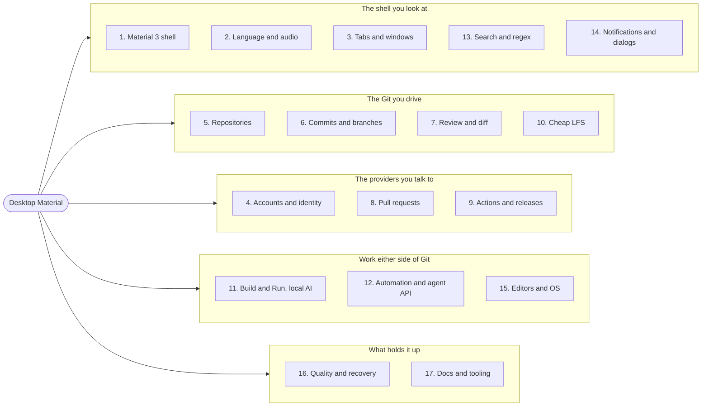
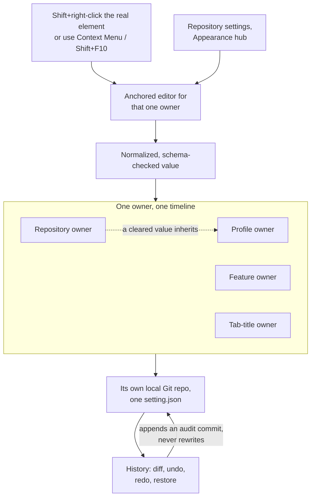
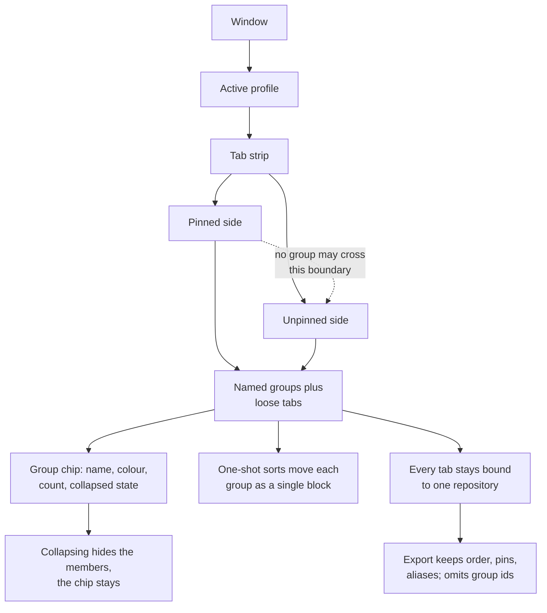
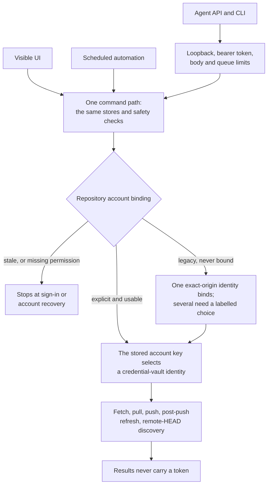
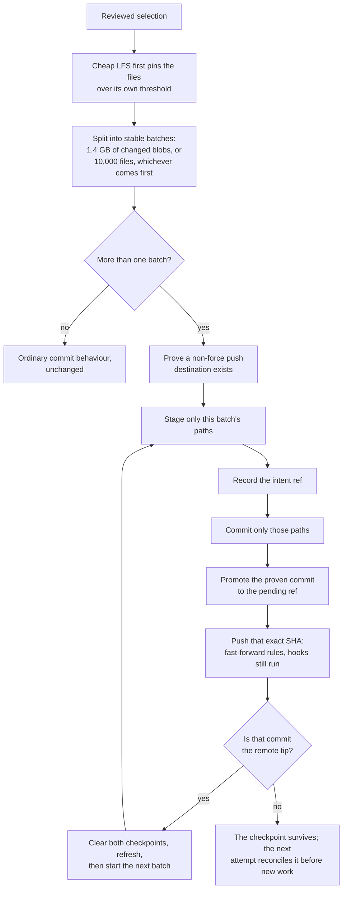

[Overview](app-doc://article/desktop-material.repository.b335630551682c19) · [Install](app-doc://article/desktop-material.repository.1e1a5fc33dbd396e) · **Features** · [Complete list](app-doc://article/desktop-material.repository.393cc524ab83ec92) · [Screenshots](app-doc://article/desktop-material.repository.5427e8e90f762374) · [Roadmap & receipts](app-doc://article/desktop-material.repository.78d607cf57dbb567) · [Development](app-doc://article/desktop-material.repository.4cbde0f6e291fe79)

Tabbed README — GitHub can't run scripts, so each tab above is a separate page.

# Features

The full Material Design 3 shell plus every Git and GitHub workflow Desktop
Material ships. For milestone status and published CI/release evidence, see the
[Roadmap & receipts](app-doc://article/desktop-material.repository.78d607cf57dbb567) tab; for annotated captures, see the
[Screenshots](app-doc://article/desktop-material.repository.5427e8e90f762374) tab.

The archived [Linux TUI prototype](app-doc://article/desktop-material.repository.15fc41b41822766b) adapted a
subset of these workflows for character-cell terminals. Its source, generated
parity contract, package notes, and five
Xvfb captures remain as historical July 27 evidence only. It is not a current
supported product/release target, and its gaps do not block the Windows
application.

> Looking for an exhaustive checklist instead of this prose tour? The
> **[Complete list](app-doc://article/desktop-material.repository.393cc524ab83ec92)** tab records every feature in one
> bilingual (English / 廣東話) table and labels each one **Added**,
> **Extended**, or **Inherited** relative to upstream GitHub Desktop.

> **July 27 published source acceptance:** the app-hosted browser, exact-90%
> Cheap LFS restore look-ahead, and private-repository lock passed the final
> focused **760/760 across 58 files** gate, 14/14 verifier contracts, full
> TypeScript check, exact Windows production build, and isolated hidden-desktop
> interaction/privacy review. The source and captures are pushed through
> `2abccae8fd`, and Pages/wiki publication is verified live. Packaged Windows
> E2E is verified. Installer/Release evidence was still pending at that dated
> checkpoint; the separate historical TUI correction is non-blocking under the
> Windows-only product boundary.

**The whole feature set on one page / 成套功能一版睇晒**

**What the map says.** Desktop Material's 201 features sit in 17 numbered
areas, clustered here five ways: the shell you look at (1 Material 3 shell,
2 language and audio, 3 tabs and windows, 13 search and the regex builder,
14 notifications and dialogs); the Git you drive (5 repositories, 6 commits and
branches, 7 review and diff, 10 Cheap LFS); the providers you talk to
(4 accounts and identity, 8 pull requests, 9 Actions and releases); work either
side of Git (11 Build & Run and local AI, 12 automation and the agent API,
15 editors and OS integration); and the foundations (16 quality and recovery,
17 documentation and tooling). Those numbers are the section numbers in the
[Complete list](app-doc://article/desktop-material.repository.393cc524ab83ec92), so the map is an index, not a
summary.

**張圖講咩。** Desktop Material 嘅 201 項功能分喺 17 個範疇，呢度夾埋做五嚿：你望住嘅外殼（1 Material 3 外殼、2 語言同聲音、3 分頁同視窗、13 搜尋同 regex、14 通知同對話框）；你揸住嘅 Git（5 倉庫、6 Commit 同分支、7 審閱同 diff、10 Cheap LFS）；你要傾偈嘅供應商（4 帳戶同身分、8 Pull request、9 Actions 同 Release）；Git 前後嗰啲工夫（11 Build & Run 同本機 AI、12 自動化同 agent API、15 編輯器同作業系統）；同埋托住成座嘢嘅地基（16 品質同復原、17 文件同工具）。啲號碼就係 [Complete list](app-doc://article/desktop-material.repository.393cc524ab83ec92) 嘅章節號，所以呢張係索引，唔係摘要。

**Advanced Git and collaboration workflows (M21)**

- Keep multiple provider identities bound to the right repository; pin, hide,
  filter, and switch large repository sets; search current-branch or all-ref
  History; inspect remote-only commits; preview an ordinary manual pull after
  a successful fetch; and run a reviewed pull/fetch batch across an exact
  repository subset
- When a repository has more than one configured remote, the ordinary Fetch
  action says **Fetch all remotes** and fetches the complete remote set in a
  stable current-first order; a one-remote repository keeps its existing
  **Fetch `<remote>`** behavior. See the [multi-remote fetch sync
  guide](../features/repository-management/multi-remote-fetch-sync.md).
- Review and create pull requests without leaving the app: inspect files in a
  tree, expand diff context, comment, reply, resolve, approve, request changes,
  edit metadata, inspect checks, receive activity notifications, and safely
  check out an exact branch or commit from another fork
- Stash only selected files, name and manage multiple stashes—including stashes
  created outside Desktop Material—and manage the complete local/remote tag
  lifecycle with reviewed destructive operations and recovery receipts
- Compare CSV/TSV data structurally, preview TGA images, open files through a
  broader editor catalog or WSL, work with network/WSL repository paths, manage
  the global ignore file, import/export patch series, run allowlisted custom Git
  command presets, and delete reviewed local branches in bulk
- Browse live GitHub Projects and a bounded last-known-good offline cache, while
  retaining existing Copilot commit-message controls and one-click editor
  actions. The [30-item demand ledger](app-doc://article/desktop-material.repository.f39bdcae25483817)
  links each request to its behavior, safety boundary, and verification contract

**Local Ollama model lifecycle (M23)**

- Add an **Ollama (local)** provider in **Settings → Copilot → Providers**, then
  open its purpose-built **Manage models** workspace without writing native API
  requests
- Inspect endpoint health/version, installed and running inventories, searchable
  model details, runtime allocation, capabilities, and bounded metadata with
  separate unavailable and partial states
- Pull with streamed progress and cancellation; copy or guarded-rename a model;
  load or unload it; and delete only after confirming the exact model name
- Synchronize Ollama's installed inventory back to that provider's selectable
  Copilot models. Management requires an exact loopback `/v1` base and derives
  only fixed native `/api/*` routes; remote HTTP/HTTPS hosts, arbitrary
  prefixes, credentials, queries, and fragments are rejected. The complete
  workspace follows English, playful Hong Kong Cantonese, or bilingual mode.
  See the
  [feature guide](app-doc://article/desktop-material.repository.d0ba43a29e7c9e23)

The accepted off-screen manager capture is a privacy-safe synthetic scene at
1452×1001. Its full health, inventory, search, running-state, pull cancellation
and rollback, completed pull, copy, rename, load, unload, confirmed-delete, and
provider-sync exercise is recorded in `HANDOFF.md`.

**Material Design 3 Expressive shell**
- App-bar branding with an inline pill menu
- Left icon navigation rail — Changes (with a badge), History, Branches, Settings, and the account avatar
- A floating pill toolbar with repository and branch chips, a small colour-coded CI result on the current branch, and a sync pill that shows an ahead badge; it measures the available lane and live ellipsis pressure, then moves Build & Run and, if needed, Commit & Push into an accessible **More** surface before labels clip
- Floating, radius-24 elevated workspace cards with an animated light/dark theme
- Full MD3 workspace surfaces: tri-state selection checkboxes, tonal status chips, token-based diff colors, an inverse-surface undo banner, and a redesigned welcome flow and blank slate
- A pure Material first-run Welcome task card and tonal workspace preview, paired with a Material 3 public landing page built from an expressive app bar, hero surface, principle cards, evidence gallery, and tonal calls to action

**Appearance customization**
- **Settings → Appearance** now contains only ordinary preferences such as language, theme, scale, repository-list behavior, branch sorting, formatting, and diff tab size. Custom visuals are never stuffed into a general Appearance page
- Choose an explicit, persisted language mode: **English**, respectful and playful
  **Hong Kong Cantonese**, or a compact **Bilingual** presentation. English is
  the safe fallback; Desktop Material does not silently replace the selection
  from the Windows locale
- About one launch in ten, a bundled photograph of a Hong Kong dim sum dish
  appears in the bottom-left corner, named in both languages —
  *Classic Har Gow · 蝦餃* — and clears itself. It never delays startup, never
  takes focus, and stays away on a first run, an error, an update, an open
  dialog, or inside your quiet hours. There is no setting to switch it off.
  See [The dim sum surprise](app-doc://article/desktop-material.repository.7866b4fb2a20d1ac)
- `Shift`+right-click an actual visual owner—or focus it and press the Context Menu key or `Shift+F10`—to open its editor beside that element. A plain right-click remains available to the surface's ordinary context menu, and surfaces that have one keep a Customize entry in it. This covers the app identity/workspace, update bar, toolbar, repository list, tab strip, code/diff surface, individual Material feature entry points, each repository name/logo, each tab title, and the temporary-submodule Back control. Specialized Git context menus keep priority on their surrounding hit areas
- Every appearance owner has one versioned `setting.json` in its own local Git
  repository and its own **History** manager with lazy diffs, undo, redo, and
  restore. History actions append audit commits; the editor footer exposes the
  exact local path. Profile owners, feature IDs, repository instances, and tab
  instances never share a mutable timeline. A rapid slider/color burst persists
  only its latest normalized value before the existing commit debounce, while
  queued setting reads and History remain strict ordering barriers
- Repository-scoped workspace, toolbar, tab-strip, list-name, and logo values can inherit their profile owner. Toolbar appearance includes safe text color plus curated family, bounded size, emphasis, case, spacing, effect, and alignment controls; a repository can inherit those typography properties individually or clear its whole local layer. A local `desktop-material.appearance-id` UUID keeps those dedicated repositories stable when the working copy moves; the old aggregate config is migration/startup compatibility only
- The temporary-submodule Back owner offers **Tonal**, **Filled accent**, or **Outlined**, plus label choices. The vector repository-logo studio keeps bounded JSON import/export and safe code-native layers; an inherited row can jump to the profile default beside the same actual logo
- Toolbar measurement respects Icons only and compact density. Build & Run overflows first, followed by Commit & Push; widening the window or shortening a dynamic label restores the same mounted controls deterministically, while an open **More** surface remains stable until it closes

**How appearance is layered.** There is no central appearance studio. You reach
an editor two ways — `Shift`+right-clicking the element that actually owns the
look (or focusing it and using the Context Menu key / `Shift+F10`), or the
Repository settings Appearance hub — and both commit through the same owner
path, so an edit made either way is indistinguishable, History included. The
normalized value lands on exactly one owner: a profile owner, a repository
owner, a feature owner, or a single tab's title owner. A repository owner whose
value is cleared inherits the matching profile value. Each owner keeps one
`setting.json` in its own local Git repository, and its History panel can diff,
undo, redo, or restore — each of which appends an audit commit rather than
rewriting the chain.

**外觀係點分層。** 呢度冇一個中央外觀工作室。你有兩條路開到編輯器：撳住 `Shift` 再右擊真正擁有嗰個樣嘅元素（或者 focus 住撳 Context Menu 掣／`Shift+F10`），或者行 Repository settings 嘅 Appearance hub；普通右擊繼續開原本嘅功能選單。兩條外觀路徑都行同一個 owner 路徑落去，所以邊度改都一模一樣，連 History 都一樣。個正規化咗嘅數值淨係落喺一個 owner 度：profile owner、repository owner、feature owner，或者某一個分頁標題嘅 owner。Repository owner 清空咗個值，就會繼承返 profile 嗰個。每個 owner 喺自己嘅本機 Git repo 揸住一個 `setting.json`，History 面板可以睇 diff、undo、redo、還原 — 每一下都係加多個審計 commit，唔會改寫舊歷史。

**Repository tabs**
- Browser-like repository tabs, per-account and bound to repos, with inline rename
- Per-tab title styling: `Shift`+right-click the actual title for bold/italic/underline, size, text color, background color, font family, and alignment, with curated palettes, recent colors, a custom picker, one-click return to default, and that tab's dedicated Git history. Ordinary right-click opens the tab command menu, whose explicit **Customize Appearance…** action reaches the same editor. The clicked tab initializes before the editor opens; an in-progress profile transition gives localized retry guidance instead of escaping to the app crash boundary
- Collect tabs into named, curated-color groups. A visible chip before the first member shows its name, count, active state, and expanded/collapsed state; mouse, Enter, or Space really hides/restores the member tabs. Group actions, dialog copy, announcements, and accessible names follow English, playful Hong Kong-style Cantonese, or bilingual mode
- Group metadata persists across open/close and bulk-close operations, per-window reloads, profile history, and session imports. A group cannot cross the protected pinned/unpinned boundary. Deleting a group never closes its tabs
- Mark tabs as favorites, drag a repository folder onto the app to open or switch its tab, and export or import the current ordered tab session with pins, favorites, aliases, and per-tab appearance. Portable exports intentionally omit profile-local group definitions and `groupId` memberships, while import preserves the destination profile's existing groups
- Keep the original **Close Tabs Containing…** regex workflow, or use the guarded inverse **Close all tabs except those containing…** action. The inverse matches a case-insensitive literal substring across the visible label, repository alias/name, and local path; live counts and a bounded preview make the result reviewable, and an empty or zero-match query cannot confirm
- Pin important tabs and arrange each pinned or unpinned group manually with drag-and-drop or named keyboard move actions. Moving a member outside its named group ungroups only that tab; one-shot A→Z, Z→A, newest-opened, oldest-opened, repository-status, and favorites-first/last sorts keep every remaining named group together as one stable block. The chosen order persists without continuously reshuffling as repository status changes
- Dragging gives a lifted-tab treatment and a live before/after insertion rail, with reduced-motion and pinned-boundary fallbacks. The strip also exposes a searchable, regex-capable **Tab history** list for restoring up to twelve recently closed tabs without losing their group, pin, favorite, label, or appearance
- Use **Search tabs** to switch by name, alias, path, or clone URL, and narrow **Arrange tabs** with its literal multi-key filter without changing the all-tab scope of one-shot sorts

**How the strip is organized.** Tabs and their groups belong to a window and a
profile, so switching either gives you that context's own strip. The strip has
a protected pin boundary and no group is allowed to straddle it; each side
holds its own named groups and loose tabs. A group is a label, never a
behaviour change: its chip carries the name, colour, member count and collapsed
state, collapsing hides the members while the chip stays reachable, the one-shot
sorts move a whole group rather than shuffling a stranger into the middle of it,
and deleting a group closes nothing. Each tab stays bound to its repository
throughout. A portable session export deliberately carries order, pins,
favourites, aliases, and per-tab appearance but not group definitions or
membership, because a group belongs to the profile that receives the import.

**成條分頁列點編排。** 分頁同佢哋嘅群組屬於某個視窗、某個 profile，所以轉窗或者轉 profile 就會見到嗰邊自己嗰條列。條列有一條受保護嘅釘住界線，冇任何群組跨得過；兩邊各自有自己嘅具名群組同散裝分頁。群組淨係一個標籤，唔會改行為：個 chip 寫住名、顏色、成員數同收埋咗未，收埋之後成員唔見但 chip 仲喺度撳得到，一次過排序係搬成嚿群組，唔會塞個唔相干嘅分頁入去中間，而刪群組更加唔會關到任何分頁。每個分頁自始至終都綁實佢嗰個倉庫。可攜嘅工作階段匯出會帶走次序、釘住、收藏、別名同逐分頁外觀，但故意唔帶群組定義同成員關係 — 因為群組係屬於接收匯入嗰個 profile 嘅。

**Multi-account**
- Multiple accounts including multiple identities per host; per-account tabs, repos, and settings
- Repository-bound HTTPS Git fetch, pull, push, post-push refresh, scheduled
  sync, refspec fetch, and remote-HEAD discovery use the exact selected account.
  Background sync reuses a namespace- and target-validated local remote HEAD;
  an explicit fetch gives discovery five seconds and process-tree cleanup one
  final five-second grace window, so the advisory refresh has a ten-second hard
  settlement bound even when a child never reports closure. A renamed default
  is still discovered when the old branch exists. Concurrent callers share one
  in-flight system proxy lookup per URL instead of multiplying abandoned
  resolver work. Missing or invalid refs still perform one authenticated
  discovery. Legacy unbound organization repositories prefer a
  verified write-capable same-host identity, while a missing explicit binding
  fails closed instead of silently using another account
- GitHub browser sign-in requests the bounded feature scopes used by the app:
  repository/user access, workflow-file updates, notifications, read-only
  organization membership, and the `write:packages` grant used by the Cheap LFS
  GHCR path. Repository deletion, package deletion, and unrelated administrative
  scopes remain excluded; the registry documentation's PAT-classic-only caveat
  is recorded in the OCI feature guide
- Browse complete GitHub organization repository lists, filter cloning by
  organization, and choose a personal or organization owner from the Publish
  dialog's non-collapsing, keyboard-operable listbox with fuzzy, substring,
  and bounded-regex search
- Add GitLab accounts, including self-hosted endpoints, with a personal access token; add Bitbucket accounts with an app password, then browse and clone their repositories from the provider tab
- Select all repositories with a mixed-state checkbox, or opt in to automatically clone only newly discovered repositories in the background. **Settings → Clone queue** keeps each signed-in account's base directory, parallel/sequential mode, and enabled state discoverable after the Clone dialog closes; auto-clone never opens an unsolicited progress dialog
- Pause and resume pending multi-clones, including after restart or an interrupted process. A bounded atomic recovery journal revalidates the exact destination, usable clean worktree, `HEAD`, and matching origin without deleting occupied folders; failed/review-required queues remain visible until explicitly dismissed
- Switching clone accounts clears stale repository selection and validation, reloads the exact account catalog, and keeps its latest async result from being overwritten by an older account/path check
- Clone a private repository from a generic HTTPS URL without a credential prompt when an eligible signed-in account matches the exact origin. Only authentication or repository-not-found ambiguity can try another exact-origin account; the successful account affinity is retained, while tokenless or stale tokenless bindings are skipped and missing, SSH, non-authentication, and cross-origin credentials never widen fallback
- The repository list can hide its automatically maintained Recent group from **Settings → Appearance**
- Filter the cloned-repository list independently by its exact bound account and provider service; local-only, unavailable-account, and unknown/signed-out scopes are explicit instead of inferred from a host name
- Repositories with exact private provider metadata show a separate localized,
  keyboard-focusable lock without replacing their fork glyph, custom logo, or
  ordinary repository icon; public and unknown metadata make no privacy claim
- Repositories can be pinned from their context menu into a dedicated top group
- Provider triage consumes the same exact repository-account binding selected in Repository Settings. One valid matching identity can bind an unassigned repository; multiple matches require an explicit labelled choice; missing, stale, permission, and organization-SSO states route to the appropriate sign-in or account-management recovery without silently replacing a valid binding

**App-hosted browser — locally accepted**

- **Settings → Advanced → Open web links** persists whether HTTP(S) links open
  inside Desktop Material or in the system browser
- The app-hosted window supplies tabs, New tab, Back, Forward, Refresh/Stop, a
  labelled URL bar, Go, ordinary bookmarks, and **Open externally**; bare hosts
  become HTTPS, while arbitrary text is never sent to a search provider
- Remote pages run in sandboxed `WebContentsView` tabs without Node, preload,
  app IPC trust, Electron permissions, downloads, or certificate bypass.
  Redirects remain in the current tab, `window.open` is captured into a new
  trusted-chrome tab, and query/fragment/credential data is removed from logs
  and bookmarks
- Authentication uses an explicit intent, an in-memory session, no bookmarks,
  automatic storage/cache cleanup, and a visible **Continue in system browser**
  escape. See the [security and recovery contract](app-doc://article/desktop-material.repository.246d4eac709d54c8)

**App 內瀏覽器 — 本機驗收已經過關。** 你可以喺
**Settings → Advanced → Open web links** 揀連結喺 app 入面定系統瀏覽器開。App
內嗰個有分頁、網址列、前後頁、重新整理、Go、書籤同外部逃生門；遠端網頁鎖喺
sandboxed `WebContentsView`，冇 Node、冇 preload、冇 app IPC 信任、冇權限、唔會
幫你下載或者繞過壞憑證。登入分頁用記憶體工作階段、加唔到書籤，閂咗會清資料，
亦永遠有得轉去系統瀏覽器。

**Versioned settings & history**
- Ordinary per-account settings remain in the profile Git repository and **Edit → Settings History…** (`Ctrl+Alt+Z`). Appearance and per-tab visual changes use the narrower element-local histories reached from their anchored editors
- Each appearance editor names and copies its exact local repository path; every element-local undo, redo, or restore appends an audit commit instead of rewriting history
- Right-click a History commit—or press the row's named **More actions** control, Context Menu key, or `Shift+F10`—for the same selection-aware reset, checkout, reorder, revert, branch, tag, cherry-pick, copy, and provider actions

**Non-modal dialog framework**
- Dialogs float without blocking the app, drag by their headers, cascade, and can be brought to front — the app stays fully interactive behind an open dialog
- Mouse-wheel and trackpad gestures scroll from anywhere over dialog content, with nested lists/editors retaining their own range and chaining to the outer body at an edge
- Preferences rebuilt as an MD3 940×660 dialog with a left rail, an Active chip, and a pill footer
- Repository and branch pickers are MD3 side sheets; the clone dialog is restyled to match
- Acknowledgement-only application errors default to dismissible red notices at the bottom right; choose traditional blocking dialogs in **Settings → Notifications**, while errors that require a decision, retry, sign-in, or remediation always remain dialogs. An error that names the affected repository's stale `.git/index.lock` offers a scoped **Remove lock file** action after Desktop confirms the repository is idle and the lock is old and unchanged
- GitHub sign-in and Git/SSH credential prompts use one recoverable FIFO, so
  concurrent host-key, passphrase, password, and generic authentication
  requests cannot be dropped by popup de-duplication

**Notification centre**
- A bell and right-hand side sheet backed by its own local git repo — search by title, message, or repository metadata; filter by event type; select all visible results; bulk mark read/unread or delete; and visibly confirm **Clear all**, with every change recoverable from Git-backed history
- Switch to a separate live GitHub inbox for any signed-in GitHub.com or Enterprise account; every available 50-item API page is fetched automatically with no 200-item display ceiling. Filter unread/all and participating threads, search titles/repositories/types/reasons, select visible results, open only validated provider links, bulk mark read/done, or confirm **Clear all** for the complete fetched inbox; partial failures remain visible for retry and remote threads are never copied into the local log

**Search everywhere, with a regex builder**
- Every search bar gains fuzzy / substring / regex filter modes, a case toggle, and per-list filter chips
- A full safe-RE2 regex builder — anchors, character classes, quantifiers,
  groups/captures, alternation, the honestly supported ignore-case flag, and a
  live match/capture tester — reachable from the search bars; unsupported
  lookaround and backreferences are explained before Apply
- The `Ctrl+Shift+F` command palette uses wider, richer rows with a leading icon, title, optional search-term line, and localized group chip. Its anchored **Customize appearance** editor persists comfortable/compact density and independent icon/group/keyword visibility; Escape closes only the editor and restores toggle focus

**Repository safety and cleanup**
- A context-menu option can permanently discard changes without sending files to the trash, including untracked files, for large cleanup operations where the regular discard flow would be slow
- Local-only branches use a clear publish indicator, including branches whose configured upstream was deleted
- Branch lists can be sorted by last activity or alphabetically from **Settings → Appearance**
- The commit composer can show the effective Git author name/email plus the winning config scope and file before commit
- Merge commits use a distinct, subdued italic summary in History so integration points are easy to scan

**Dynamic UI scaling**
- A UI-scale slider (50–200%) in Preferences → Appearance plus auto-fit-to-window that shrinks the interface to fit smaller windows (on by default), composing with `Ctrl` `+` / `-` / `0`
- At the supported minimum window size, a requested 200% scale safely auto-fits below the requested maximum, keeping the title bar, navigation, Appearance controls, and footer visible without horizontal clipping; the latest P0 gate measured 94%, while the earlier screenshot in the [Screenshots](app-doc://article/desktop-material.repository.5427e8e90f762374) tab records a 96% viewport

**Per-repo `.gitignore` manager**
- Open **Repository → Manage .gitignore…** for a manager that auto-suggests templates from your repo's contents, a searchable catalog of ~19 templates grouped by category, one-click apply/remove, and a raw editor — all merged into marked, reversible sections

**One-click Build & Run**
- Auto-detects bounded, nested project roots and runnable profiles for Node/npm/yarn/pnpm/bun, Deno, Rust, Go, .NET, Python, Java/Kotlin, PHP, Ruby, Swift, Dart/Flutter, Elixir, Scala, Haskell, Zig, Make, and CMake; each choice shows its project folder so similarly named profiles are unambiguous
- Installs dependencies, builds, and runs the selected profile in one action, streaming output to an MD3 log panel with a one-shot **Scroll to bottom** action, persisted auto-scroll that pauses when the user reads history, and persisted display-only long-line truncation that leaves the complete text available to **Copy all output**
- Auto-ignores build outputs (applies the matching `.gitignore` template + an artifacts section) before building
- Bounded auto-fix on failure through a per-repository choice of Codex CLI or OpenCode, stdin-only prompts, explicit install/auth/auto-approve consent, renderer-owned process-tree cancellation, and a Build & Run verification rerun unless **Stop** cancels it; plus a per-repo settings tab, bounded nested-project discovery, optional single-prompt UAC pre-elevation, and English, playful Hong Kong Cantonese, or bilingual labels

**Automation and GitHub Actions**
- Configure scheduled commit-and-push and pull globally, override them per account or repository, and rely on safety guards that skip unsafe repositories and preserve draft commit messages
- Run commit-and-push immediately, or merge all branches/worktrees with per-target progress and Copilot-assisted conflict handling
- Browse GitHub Actions runs in the repository rail, filter by workflow/branch/event/status, re-run all or failed jobs, inspect jobs and steps, securely download and search logs, search each loaded artifact catalog with fuzzy/substring/safe-regex modes, and dispatch workflows with inputs. A protected-main **CI Windows** dispatch can select `cloud` or `[self-hosted, Windows, X64, desktop-material-windows-local]`; pushes, pull requests, and reusable calls remain hosted. Actions caches remain listable, searchable, and deletable; cache-archive download is labeled unavailable because GitHub exposes no supported download API, while workflow artifacts retain their verified download path
- Cancel only queued, running, waiting, or pending workflow runs from a Material confirmation that identifies the exact workflow/run, ref, actor, and commit when available. The app revalidates repository, account, run identity, and cancellable status before one normal cancellation request, prevents duplicate submission, then refreshes until GitHub reports a terminal state
- Dispatch **Build Installers / Express Release** from `main` when a release is urgent: lint, Windows x64 trampoline/unit/script tests, and packaging run in parallel, exact installed dependencies are content-cached, the complete installer payload is retained as a workflow artifact before publication, and one create-only command publishes deterministic exact-commit notes without replacing an existing tag
- Dispatch the separate **Super Express Release** workflow only for an emergency direct lane: its Windows package runs the complete script-contract suite before build and publication, while unit, TUI, lint, type, parity, smoke, and packaged E2E tests remain in ordinary CI and tested Express. It then builds Windows x64 and Linux TUI packages in parallel through their own reusable workflows. The direct Windows `workflow_dispatch` action preserves its verified artifact, keeps both build and publication on `[self-hosted, Windows, X64, desktop-material-windows-local]`, and publishes one uniquely tagged, non-draft Windows Release marked `Latest` after asset verification; the direct Linux TUI action remains packaging-only, and reusable calls remain artifact-only. Windows packages are permanently unsigned, must report `NotSigned`, and disclose possible SmartScreen or unknown-publisher prompts. A cold Windows publisher installs pinned checksum-verified PortableGit, GitHub CLI, and `jq` below `RUNNER_TOOL_CACHE`. The combined dispatcher restores the exact desktop dependency cache, runs every job on the registered self-hosted Windows or Linux runner, writes notes from the checked-out commit, verifies every installer/feed/package asset, retains the complete payload, and publishes one uniquely versioned immutable combined Release for the exact dispatched `main` commit. If a required local runner is unavailable, the affected build or publisher queues or fails rather than escaping to a hosted runner. Keeping the combined publisher as the only cross-platform publisher preserves the shared `latest` update/bootstrap feed. Ordinary CI and tested Express remain the default gates. Automatic and Super Express packages share one Squirrel-monotonic `z` version namespace, with a run-attempt suffix for reruns, and only the greatest release for revalidated current `main` can own the update feed

**Agent access and command line**
- Enable an opt-in, token-gated local agent server from **Settings → Agent access**; it exposes MCP and REST on a random loopback-only port and never returns account credentials
- In **Paired LAN devices** mode, use **Open mobile connection page** to replace any old code and open a fresh five-minute, one-use pairing link in the default browser; the secret remains in the URL fragment and is never sent to the site server
- Use the bundled stdio proxy or command-line client to list accounts/repos/tabs, inspect status, clone, commit, fetch/pull/push, manage branches/tabs, run automation, and dispatch workflows
- Turn a validated REST catalog request or named GraphQL operation into a profile-backed **App function** from the API rail. Functions are bound to the exact repository, provider, and account; read functions extend the local MCP/REST agent catalog, while mutation functions always return to the visible review step

**Why three front doors reach one back door.** Whether a Git operation is
started by clicking in the UI, by scheduled automation, or by the opt-in local
agent server, it executes through the same stores and the same safety checks —
the agent route simply passes a loopback, bearer-token, body-size and queue
gate first. From there the repository's own account binding, not sign-in order,
decides which identity is used: the stored account key selects a
credential-vault identity, a binding that has gone stale or lost permission
stops at account recovery instead of borrowing a neighbour, and a legacy
never-bound repository is bound by a single exact-origin match while several
matches ask you to choose. Account credentials are never returned in a result.

**點解三度前門通向同一度後門。** 一個 Git 操作，無論係你喺介面撳出嚟、排程自動化跑出嚟，定係由你自己開啟嘅本機 agent 伺服器叫出嚟，都係行同一批 store 同同一批安全檢查 — agent 嗰條路淨係要先過 loopback、bearer token、body 大細同佇列嘅關卡。之後決定用邊個身分嘅，係倉庫自己嘅帳戶綁定，唔係邊個先登入：儲住嗰條帳戶 key 會撳出憑證保險庫入面嘅身分；綁定過期咗或者冇權限就停喺帳戶復原，唔會靜靜雞借隔籬個帳戶；而從來未綁過嘅舊倉庫，如果同 origin 淨係有一個身分就自動綁，有幾個就要你自己揀。結果永遠唔會帶住權杖走。

**Power-user history, stashes, and windows**
- Search History by title, message, tag, or hash and open the dedicated full-width Graph repository page that visualizes commit ancestry
- Use the repository-wide Stash Manager to create, inspect, apply, pop, rename, branch from, or delete an exact stash while retaining partial-failure context; the separate tabbed manager searches every Git stash without a 500-entry cap, keeps recovery identities visible, and exports selected entries as a directory, ZIP, or configurable 7z archive
- Pull every repository from the repositories sheet with per-repository results; an ambiguous HTTPS authentication or not-found response can retry every remaining token-bearing signed-in account for that exact origin without displaying an identity or token
- Deepen or unshallow a repository from History/Repository Tools with the same exact-origin Desktop credential trampoline and bounded signed-in-account recovery when the default credential is rejected
- Use repository pinning/grouping, branch presets/default-branch controls, and per-repository editor overrides
- Add, lock, move, rename, repair, remove, or prune worktrees, and open repositories or worktrees in separate windows with isolated per-window selection and persisted tabs
- Choose **File → Add local repository → Auto-detect repositories…** to scan a parent folder with bounded, link-safe traversal, review the discovered Git repositories, and add them together

**Guided Git and provider administration**
- Manage cone-mode sparse checkout through a three-step **Choose/Adjust/Restore → Review selection → Apply and refresh** guide that remains visible above the scrolling editor and review content. State-aware guidance distinguishes empty, invalid, ready, running, and completed states; review freezes and shows every bounded normalized selection entry before Git updates and refreshes the worktree
- Exchange reviewed patch series, rewrite local commits from an explicit plan,
  configure commit/tag signing, administer Git LFS, and run bounded guided
  bisect sessions from named Repository Tools panels. The repository rail's
  direct **Large files** manager lists, searches, pins, and materializes
  Release- and OCI-backed Cheap LFS pointers. It owns the repository page's
  vertical scroll, so a long inventory stays reachable, and its direct
  **Open Cheap LFS settings** action opens **Repository settings → Cheap LFS**.
  For Release storage, automatic
  uploads prefer the trusted, isolated `gh api` exact-range transport, avoiding
  Electron's crash-prone native upload pipe when GitHub CLI is available; the
  memory-bounded native path remains a compatibility fallback. Reconciliation
  scans up to 1,000 assets once then polls only an exact asset ID, fails closed
  on an incomplete asset, and retains the exact Release editor plus verified
  whole-batch drag/drop recovery. It reports throttled hash/staging progress,
  checks worst-case temporary space, polls cancelably for six hours, and creates
  ordered `.partNNN` range files above the per-asset limit. Flat case-safe
  assets map back to original nested paths; prerelease buckets hold at most
  1,000 assets without splitting a multipart file or manual batch; Materialize
  all shares one inventory per Release and verifies/reassembles original bytes
- Live public/private acceptance materialized and re-pinned deterministic 1 MiB payloads through the production Large files UI and native Windows picker, then pushed the resulting five-line pointers as real `main` history. See the [dated UI receipt](app-doc://article/desktop-material.repository.b6a99770849bdddb)
- Choose published-prerelease, GHCR, or Docker Hub Cheap LFS storage per
  repository. The OCI choices keep the full current object set in one logical
  image within explicit 4,096-object, 8,192-layer, and 8 MiB metadata proof
  bounds: additions and removals publish a new immutable manifest, reuse
  unchanged blobs, retention-tag every historical digest, and rewrite
  pointer-form files to the verified digest while leaving already materialized
  raw files intact. Existing Docker organization
  or collaborator namespaces are retained; verified materialized files can be
  migrated between GHCR and Docker Hub as a fresh full snapshot.
  Private-source chunks use AES-256-GCM with the intentionally tracked shared
  repository key; public OCI and public GitHub.com Release pointers can restore
  while signed out. Windows builds ship digest-pinned ORAS 1.3.2 plus its
  Apache-2.0 license; the ARM64 package currently runs that audited x64 binary
  through Windows 11 x64 emulation and fails closed if it cannot start. See
  [Cheap LFS OCI registry storage](app-doc://article/desktop-material.repository.62007f3b1976de91)
- Automatic Cheap LFS preparation can run sequentially or with at most three
  files uploading at once. It cheap-stats the complete reviewed selection
  before content-proofing only oversized candidates, then shows per-file
  phases/bytes, worker and queue state, provider context, elapsed time,
  throughput, and ETA in a keyboard-accessible compact terminal below Commit.
  The panel also reports the selected-versus-recommended provider.
  Release restore is separately capped at two shared download lanes: the next
  file or multipart part starts only when the current provider transfer reaches
  the exact 90% point. The shared restore panel distinguishes current and
  look-ahead lanes; file/part ordinals; logical versus actual network bytes;
  download, decompress, verify, materialize, and cancel phases; queue,
  successes, failures, elapsed time, rate, and ETA. Combined local tests, the
  exact production build, and hidden-desktop acceptance pass; remote
  publication remains a separate gate.
  Failed raw
  files stay selected for retry while unrelated changes and successful pointers
  may commit. The Changes filter can isolate files over the same 100 MiB
  threshold, and the default clone/open detector repairs both new and older
  pointer-only clones through verified local materialization. Private registry
  key validation accepts a Windows-hostile legacy path only when fresh Git
  status proves that exact selected path is deleted; a current unsafe path or a
  real OCI pointer in a control-plane path remains blocked
- When many ordinary small files approach a decimal 1.5 GB push, Desktop
  Material automatically creates and pushes commits with a conservative 1.4 GB
  changed-blob budget plus bounded path/proof overhead. It proves each
  fast-forward remote tip before creating the next commit, retains a durable
  retry checkpoint, and uses process-local no-delta/no-compression packing for
  only the immutable exact-SHA batch push so CPU-bound packing cannot strand an
  otherwise safe batch. Ordinary pushes and persistent Git configuration stay
  unchanged. It
  safely rebuilds an individually oversized, linear, clean local-only commit
  from an older app behind a compare-and-swap backup ref. Safe older commits
  retain their exact objects; a rebuilt oversized commit preserves its reviewed
  message/final tree but necessarily receives new IDs and loses commit
  signatures. See
  [Automatic commit and push batching](app-doc://article/desktop-material.repository.6eb182e770051520)

**How a huge selection reaches the remote.** Cheap LFS runs first, as a
separate earlier step, so genuinely large files become pointers before ordinary
Git bytes are ever measured. What remains is split on a stable file order under
two ceilings at once — 1.4 GB of changed blobs (100 MB of the decimal 1.5 GB
budget is reserved for pack overhead) and 10,000 files, plus a conservative
48 MiB raw-diff estimate — so a mountain of tiny files splits too. One batch
behaves exactly like an ordinary commit. Two or more, and Desktop Material
first proves a non-force destination, then repeats a strict loop per batch:
record an intent ref, commit only that batch's paths, promote the proven commit
to a pending ref, push that exact SHA, and only create the next commit once the
push is proven to be the remote tip. If the push, the app, or the machine dies
mid-loop, those two compare-and-swap checkpoints are what the next attempt
reconciles before it starts anything new. Ordinary pushes and your persistent
Git configuration are untouched.

**一大堆嘢係點樣推得上遠端。** Cheap LFS 行先，係獨立而且更早嘅一步，所以真係大嗰啲檔喺度量普通 Git 位元組之前就已經變咗指標。剩低嘅按穩定檔案次序切開，同時受兩條上限管住 — 1.4 GB 變更 blob（十進制 1.5 GB 預算入面留返 100 MB 俾打包開銷）同 10,000 個檔，再加一個保守嘅 48 MiB raw diff 估算 — 所以一大堆芝麻綠豆咁細嘅檔一樣切得開。得一批嘅話，行為同普通 commit 一模一樣。兩批或以上，Desktop Material 會先證明有一個唔使 force 嘅推送目的地，跟住逐批死板咁行呢個圈：寫低 intent ref、淨係 commit 呢批嘅路徑、將證實咗嘅 commit 升做 pending ref、推嗰個精確 SHA，直到證實佢真係遠端 tip 先至開下一個 commit。中途死機、閂咗 app 或者推到一半斷線，下次嘅嘗試就係靠嗰兩個 compare-and-swap 檢查點對返數，先至做新嘢。普通 push 同你嘅持久 Git 設定完全冇郁過。

- Use the primary toolbar or application-menu Pull action to fetch and review the exact current/upstream object IDs, ahead/behind state, configured integration route, and bounded incoming commits and files before Git changes a clean worktree. Confirmation revalidates the full reviewed OID and integrates it without a second fetch; a failed fetch cannot surface stale tracking data. English, playful Hong Kong Cantonese, and bilingual review copy follow the saved language mode, while scheduled and local-agent automation remain noninteractive. See [Reviewed ordinary Git pull previews](app-doc://article/desktop-material.repository.787dc7a935c4418c)
- Rebase the current branch onto a searched target through a reviewed current→target summary with ahead/behind context and a bounded commit preview. Fresh preflight state blocks dirty or conflicted repositories and ongoing operations, exact refs are revalidated before Git starts, conflicts remain in the existing continue/abort flow, and Desktop Material never force-pushes automatically
- Manage every named remote with guarded add/rename/update/default/remove operations, and inspect or create exact known client hooks through the effective `core.hooksPath` without displaying hook contents or absolute paths. Remote rows stack before their name, URL, and controls collapse below a readable width, and the Repository Tools workspace keeps its diagnostics and results vertically reachable at compact heights
- Save a credential-vault-backed SSH working copy in **Repository Settings → Remote**, then Clone, inspect Status, Fetch, Pull, Push, or deploy Docker Compose. The paired remote site can list the same redacted host definitions and request a reviewed clone without receiving a password or key. Updates are fast-forward-only on the configured branch; Desktop never resets or force-checks out the host. Public site hosting remains explicit server configuration: point DNS at that SSH host and configure its reverse proxy, TLS certificate, and container port outside Desktop Material
- Add a submodule from **Repository settings → Submodules** through the same GitHub.com, Enterprise, URL, and GitLab/Bitbucket chooser used for cloning. The reviewed flow keeps exact-account credential affinity, validates a safe empty repository-relative path and optional branch, streams bounded progress, and offers real cancellation before refreshing the submodule list
- Open any initialized submodule with **Open temporary viewer**, or use the same action on a changed/new submodule commit card. The checked-out child opens read-only in the current workspace and is never added to the repository list, Recent group, or persisted last selection. The context bar provides both the customizable Back control and an obvious **Close viewer** action; either returns to the saved parent and clears temporary viewer state. The adjacent **Subtrees** tab embeds the full add, pull, push, and split manager. Stale, uninitialized, invalid-Git, traversal, sibling-prefix, and symlink/junction escape targets fail without importing anything
- Pin, hide, solo, and restore branch visibility; preview exact merge-tree conflict paths before a merge changes the worktree
- Triage bounded Issue and pull-request summaries for the exact selected GitHub, GitLab, or Bitbucket account/repository, including explicit provider-unavailable, unsupported, partial, and capped states

**Guided GitHub workflows**
- Compose pull requests with repository templates and metadata, then inspect, update, review, close/reopen, or merge the exact reviewed pull request through a fail-closed lifecycle
- Browse paginated Actions artifacts, download with bounded redirect and digest checks, and inspect the effective rules that apply to the current branch
- Use the repository Releases dashboard to compare loaded, stable, prerelease, and draft counts; search and status-filter its compact high-zoom catalog with an 800×560 small-screen gate proven at 100%, 125%, 150%, and 200%, readable size floors, and a wrapping English/Cantonese/bilingual tools disclosure; inspect authors, locale-aware 24-hour timestamps, targets, asset types, digests, and download totals; open a verified downloaded file or show it in Explorer; create reviewed releases publicly in one operation or save them as drafts; and keep bounded edit, publish, delete, upload, and download workflows. Browse, search, filter, inspect, edit, comment on, close, or reopen Issues through repository/account-bound review state
- Use the repository-contextual GitHub API functions surface, bound to the selected account and provider host, to run automatically added repository, issues, pull-request, release, and workflow actions as buttons; hide the API rail item when it is not needed, and reveal the full REST/GraphQL catalog only for advanced custom functions

### Responsiveness and resource lifecycle

- Reuse a valid local remote default during background sync; explicit fetches
  refresh it with a five-second bound so default-branch renames remain visible
- Collapse synchronous appearance bursts into one latest-value write without
  crossing queued `get()` reads, flushes, or owner-history operations
- Release same-origin request records on success, failure, and cancellation,
  preventing failed network requests from growing process-lifetime state
- Sandboxed Markdown previews remove capture listeners, cancel deferred scroll
  work, and release iframe references on unmount

**Fully Material, everywhere**
- The remaining stock surfaces — tooltips, menus, banners, autocomplete popups, segmented controls, split-buttons, dialog internals, History/CI surfaces — are re-tinted through the Material token system in both light and dark themes
- Every button now exposes a shared hover and keyboard-focus hint derived from its explicit help text, accessible name, or visible label; icon-only native buttons mounted later by dialogs and virtualized views receive the same non-native tooltip treatment
- Compact-height dialogs and tools keep named actions reachable without page-level horizontal clipping. In particular, the Regex Builder reflows its category/token grid and scrolls its body while preserving the tester and footer, and the Remote Manager protects readable field/control widths before stacking
- The exhaustive responsive gate inventories every repository rail page, preferences tab, repository-settings tab, clone tab, nested API/File History/notification surface, and safe menu dialog, then proves true-bottom reachability at desktop, minimum, narrow, short, wide, 125%, 150%, and minimum-window 200% scenarios

**Also shipped:** multi-clone with organization chips, parallel/sequential modes and URL-only import/export; one-click commit and push with a generated message; self-update checks against Desktop Material releases; SVG diff hardening and display controls; safer undo/reset/tag deletion confirmations; and responsive, keyboard-accessible MD3 surfaces throughout the app.
