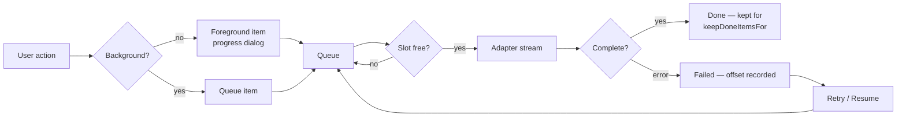

# Transfers and the queue

Everything that moves bytes goes through the queue in `design/main/queue.js`.
There is no "quick" path that bypasses it: a double-click download and a
thousand-file recursive upload are the same mechanism with different item
counts, which is why pausing, throttling and resuming work uniformly.

## Articles

| Article | Covers |
| --- | --- |
| [queue.md](app-doc://article/material-winscp.repository.a97eb2e4ae1a0889) | Queue mechanics: parallelism, ordering, pause/resume, on-empty actions. |
| [file-buffer.md](app-doc://article/material-winscp.repository.2de3f6f1edbd8a02) | Byte-level EOL conversion, split BOM/Ctrl-Z handling, bounded buffering, and transfer metadata. |
| [transfer-settings.md](app-doc://article/material-winscp.repository.ede592cd6d4e2d32) | Every transfer option, and the named presets that bundle them. |
| [resume.md](app-doc://article/material-winscp.repository.aab408eda60c69e6) | Resume, `.filepart` files, overwrite modes and what each protocol can actually do. |
| [speed-limits.md](app-doc://article/material-winscp.repository.22b4cd406df4a5ee) | Per-transfer and global throttling, and how the limit is enforced. |
| [overwrite-decision.md](app-doc://article/material-winscp.repository.831ee24dae62f103) | What happens when the file is already there: the batch-mode ladder, the per-file question, and every refusal behind the Append and Resume buttons. |
| [remote-transfer-dialog.md](app-doc://article/material-winscp.repository.c601cb1cd521dc75) | Remote duplicate/move validation, capability gating at the dialog and IPC seam, server-side copy routing, cancellation, and IPC failure behaviour. |
| [queue-controller.md](app-doc://article/material-winscp.repository.fd77d303ae40fef8) | The production command surface for accessible queue actions, model reconciliation, retries, once-done choices, and IPC-safe reconciliation failures. |

## The shape of a transfer

An item carries its own copy of the transfer settings it was created with, so
changing the defaults mid-queue never retroactively alters something already
queued. That is deliberate: a user who lowers a speed limit expects it to apply
to what happens next, not to reinterpret what they already asked for.

The same mask predicate is used for a directory's children and for a single
file selected directly. A selected file that does not match `includeFileMask`
never enters the plan, so the queue and foreground transfer paths cannot
disagree about whether that file should move.

## Postman

Not applicable — this project exposes no HTTP API. See the
[documentation index](app-doc://article/material-winscp.repository.0b5ca119d2be595a).

## Suggested articles

- Protocols — what supplies the streams, and which capabilities constrain the queue.
- Synchronization — the other producer of queue items.
- [File masks](app-doc://article/material-winscp.repository.a3cb68eed237457c) — the include/exclude language transfers use.
