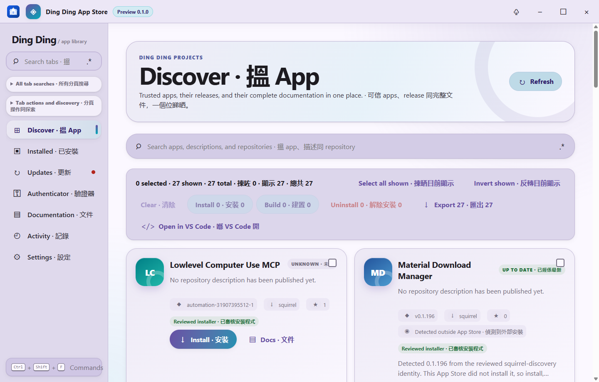

# Expressive storefront shell

## Behaviour

The desktop shell uses a custom frameless title bar, a left-first tab rail, and a layered content surface. The rail keeps the existing browser-style tab contract: pinned tabs, groups, overflow, per-strip and per-group search, the master tab search, bulk close actions, keyboard traversal, locks, and the `Ctrl+Shift+F` command palette remain the same controls with the same destinations.

Catalog, Installed, and Updates cards use a three-column hierarchy (selection, deterministic local mark, and app facts/actions). The mark is generated from the reviewed app name, so an absent or future icon field cannot blank the card or trigger a network fetch. Status, version, package type, stars, ownership, operation progress, and the app-specific action remain factual and visible.

Loading, empty, offline, update-ready, and failed states use distinct semantic surfaces. Information remains non-blocking; destructive uninstall and bulk actions still use the existing native confirmation route. The appearance editor continues to address every registered shell element, including the new visual layers.

## Configuration

Theme, density, accent, font, language, funny-level, School mode, personal vocabulary, scheduled settings, and reduced-motion preferences continue to resolve through the existing settings and appearance stores. The expressive tokens are CSS-only presentation defaults; no catalog record, installer adapter, or source broker data is changed by this feature.

## Failure modes

If the catalog is unavailable, the shell retains its offline/cache warning and keeps search, documentation, settings, history, and palette routes usable. If a future catalog payload carries icon metadata, the renderer ignores untrusted remote URLs and keeps the deterministic name mark until a reviewed local asset contract exists. Narrow layouts collapse the rail and reflow cards without hiding actions.

## Security considerations

The redesign does not add renderer privileges, network requests, executable paths, installer arguments, or raw catalog fields. It only changes CSS and app-owned presentation. Remote-authored documentation, release facts, and operation messages still use the existing isolated renderers and typed bridges.

## Verification

The expressive contract is covered by the existing renderer TypeScript build, UI completion checks, appearance registry, tab/search, language, School mode, and responsive CSS paths. Focused source checks assert the expressive token layer, three-column card hierarchy, deterministic mark fallback, semantic state classes, and documentation entry. Packaged hidden-desktop capture remains the decisive visual evidence and must be taken from the built Windows artifact through the sanctioned cheap headless route.

## Suggested articles

- [Tab workspace](tab-navigation.md)
- [Appearance editor](appearance-editor.md)
- [Catalog language coverage](catalog-language.md)
- [Privacy and security](../security/privacy-and-security.md)
